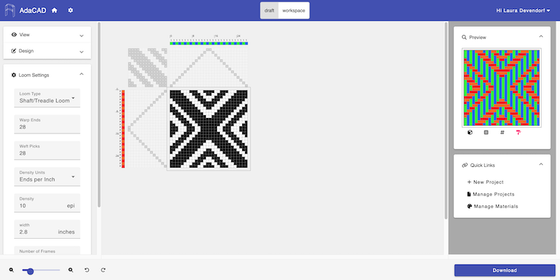

Since making our beta release of AdaCAD 4.0 available almost one year ago, we have been testing it in various contexts, from classroom teaching, workshops, and within our own practice. This exploration has given rise to several new areas of focus and directions for the future of AdaCAD. As a result, we have taken on a dramatic new redesign the redesign that we have no released yet, but want to preview here to get your feedback. This new version will do 90% of the same things as the current stable version, but it includes new features and ways of representing the different design elements. This includes methods for loading and saving multiple files to an online directory, simulating your structures, and new operations for making playful algorithmic drafts (e.g. "glitch satin"). 

This is a screen shot of the new interface for the AdaCAD mixer, which emphasizes the relationship of operations in AdaCAD as similar to programming blocks (like those in Scratch), which can be arranged and connected to generate different results, shown in the view on the right. We see this view being ideal for people familiar with parametric design (but new to weaving) or complex weavers who are looking to manage multiple structures and relationships between structures. We aim for this view to emphasize playfulness while also opening pathways to document multi-layer or otherwise complex weave structures.

We offer two modes of working in AdaCAD 4.0, the first emphasizes traditional modes of draft making while the second emphasizes AdaCAD's parametric design functionality. This is the "Editor" view that allows one to specify different threading and treadling patterns for different loom configurations. 

### We'd love your feedback!
As we said before, this new user interface is unreleased, and before we overwrite the current beta version, we'd like to know what you think. What new features would you love to see? What features should we make sure to keep? Any and all thoughts and feedback are welcome at unstabledesignlab@gmail.com. 

