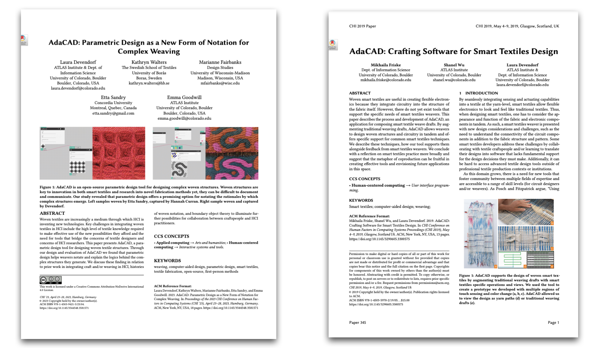

# Research 

AdaCAD is part of an active and ongoing research project that includes the [Experimental Weaving Residency](https://unstable.design/experimental-weaving-resdiency/), the [Experimental Weaving Talk Series](https://unstable.design/experimental-weaving-talks/) and the [Experimental Textiles Course Curriculum](https://extx.unstable.design/). Collectively, these programs explore methods to bridge craft and engineering for the sake of creating more robust, sustainable, and aesthetically rich interactions with technology. The project is supported by National Science Foundation Grants [#2346150](https://www.nsf.gov/awardsearch/showAward?AWD_ID=2346150&HistoricalAwards=false), [#1943109](https://www.nsf.gov/awardsearch/showAward?AWD_ID=1943109), and [#1755587](https://www.nsf.gov/awardsearch/showAward?AWD_ID=1755587). 

## Original Projects

### CHI 2023, AdaCAD: Parametric Design as a New Form of Notation for Complex Weaving
This paper, published at CHI in 2023, details the shift of AdaCAD to a parametric design framework and how those new features were taken up and extended in collaboration with Kathryn Walters, Etta Sandry and Marianne Fairbanks. We argue more broadly that parametric design can be seen as an evolved form of weaving notation that offers specific benefits for facilitating collaboration engineers and craftspeople. 

Full Citation: Laura Devendorf, Kathryn Walters, Marianne Fairbanks, Etta Sandry, and Emma R Goodwill. 2023. AdaCAD: Parametric Design as a New Form of Notation for Complex Weaving. In Proceedings of the 2023 CHI Conference on Human Factors in Computing Systems (CHI '23). Association for Computing Machinery, New York, NY, USA, Article 127, 1–18. https://doi.org/10.1145/3544548.3581571

- [paper](https://dl.acm.org/doi/10.1145/3544548.3581571)
- [project](https://unstable.design/parametric-design-as-weaving-notation/)

### CHI 2019, AdaCAD: Crafting Software For Smart Textiles Design
This paper, published at CHI in 2019, describes our first iteration of AdaCAD and how it could specifically respond to teh challenges of representing both woven structures and circuitry in tandem. 

Full Citation: Mikhaila Friske, Shanel Wu, and Laura Devendorf. 2019. AdaCAD: Crafting Software For Smart Textiles Design. In Proceedings of the 2019 CHI Conference on Human Factors in Computing Systems (CHI '19). Association for Computing Machinery, New York, NY, USA, Paper 345, 1–13. https://doi.org/10.1145/3290605.3300575

- [paper](https://doi.org/10.1145/3290605.3300575)

## Related Work

### TEI 2024, Loom Pedals: Retooling Jacquard Weaving for Improvisational Design Workflows.
This paper describes hardware and software extensions to AdaCAD and the TC2 looms that enable improvisational workflows. Specifically, it describes the design of pedals that connect to the loom so that someone can manipulate drafts as they weave, without having to redesign and reupload a new design file. 

Full Citation: Shanel Wu, Xavier A Corr, Xi Gao, Sasha De Koninck, Robin Bowers, and Laura Devendorf. 2024. Loom Pedals: Retooling Jacquard Weaving for Improvisational Design Workflows. In Proceedings of the Eighteenth International Conference on Tangible, Embedded, and Embodied Interaction (TEI '24). Association for Computing Machinery, New York, NY, USA, Article 10, 1–16. https://doi.org/10.1145/3623509.3633358

- [paper](https://doi.org/10.1145/3623509.3633358)

### XRDS 2023: Making Design Tools like a Weaver: Four Rules
This article, which is intended for student researchers in the field of HCI, describes what computational design tools would look like if they drew more deeply from the histories and practices of weaving. 

Full Citation: Laura Devendorf, Shanel Wu, and Mikhaila Friske. 2023. Making Design Tools Like a Weaver: Four Rules. XRDS 29, 4 (Summer 2023), 54–58. https://doi.org/10.1145/3596929

- [article](https://doi.org/10.1145/3596929)

### CHI 2020: Unfabricate: Designing Smart Textiles for Disassembly
A design investigation of if and how woven smart textiles could be disassembled. Includes an extension to AdaCAD for shaped weaving.  

Full Citation: Shanel Wu and Laura Devendorf. 2020. Unfabricate: Designing Smart Textiles for Disassembly. In Proceedings of the 2020 CHI Conference on Human Factors in Computing Systems (CHI '20). Association for Computing Machinery, New York, NY, USA, 1–14. https://doi.org/10.1145/3313831.3376227
- [paper](https://doi.org/10.1145/3313831.3376227)

## Other Research Engaging AdaCAD

Elizabeth Meiklejohn, Laura Devendorf, and Irene Posch. 2024. Design Bookkeeping: Making Practice Intelligible through a Managerial Lens. In Proceedings of the 2024 ACM Designing Interactive Systems Conference (DIS '24). Association for Computing Machinery, New York, NY, USA, 35–49. https://doi.org/10.1145/3643834.3660754

Alice Buso, Holly McQuillan, Milou Voorwinden, and Elvin Karana. 2023. Weaving Textile-form Interfaces: A Material-Driven Design Journey. In Proceedings of the 2023 ACM Designing Interactive Systems Conference (DIS '23). Association for Computing Machinery, New York, NY, USA, 608–622. https://doi.org/10.1145/3563657.3596086

Kathryn Walters, Laura Devendorf, and Karin Landahl. 2024. Animated Linen: Using High-twist Hygromorphic Yarn to Produce Interactive Woven Textiles. In Proceedings of the 2024 ACM Designing Interactive Systems Conference (DIS '24). Association for Computing Machinery, New York, NY, USA, 1177–1191. https://doi.org/10.1145/3643834.3662146

Nikita Menon K. P., Eldy S. Lazaro Vasquez, Hannah Curran, Sasha De Koninck, and Laura Devendorf. 2023. Weaving Augmented Reality Markers. In Adjunct Proceedings of the 2023 ACM International Joint Conference on Pervasive and Ubiquitous Computing & the 2023 ACM International Symposium on Wearable Computing (UbiComp/ISWC '23 Adjunct). Association for Computing Machinery, New York, NY, USA, 310–314. https://doi.org/10.1145/3594739.3610786

