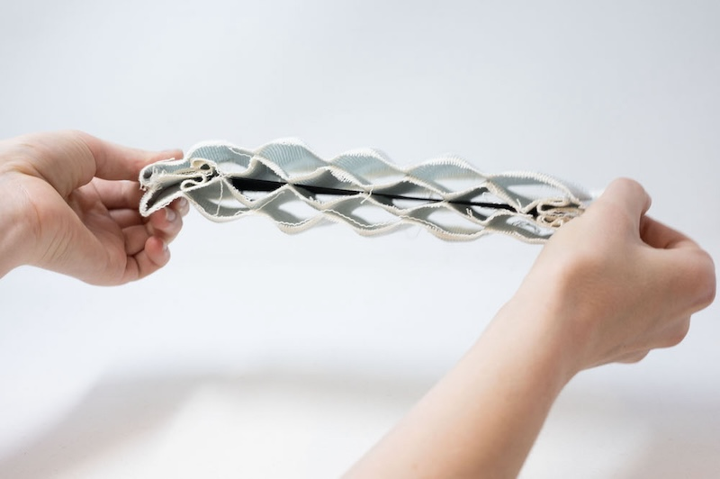
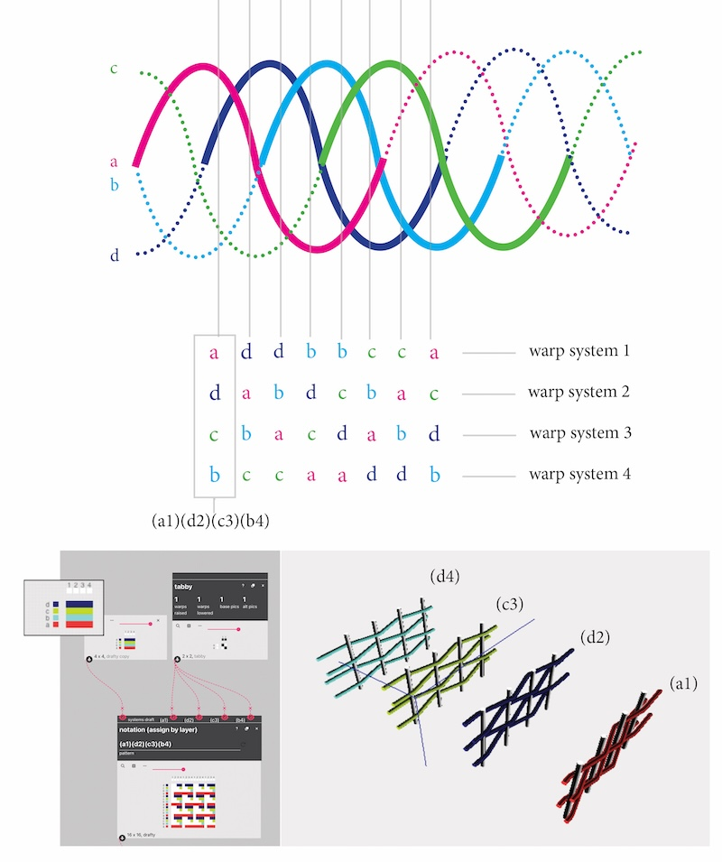
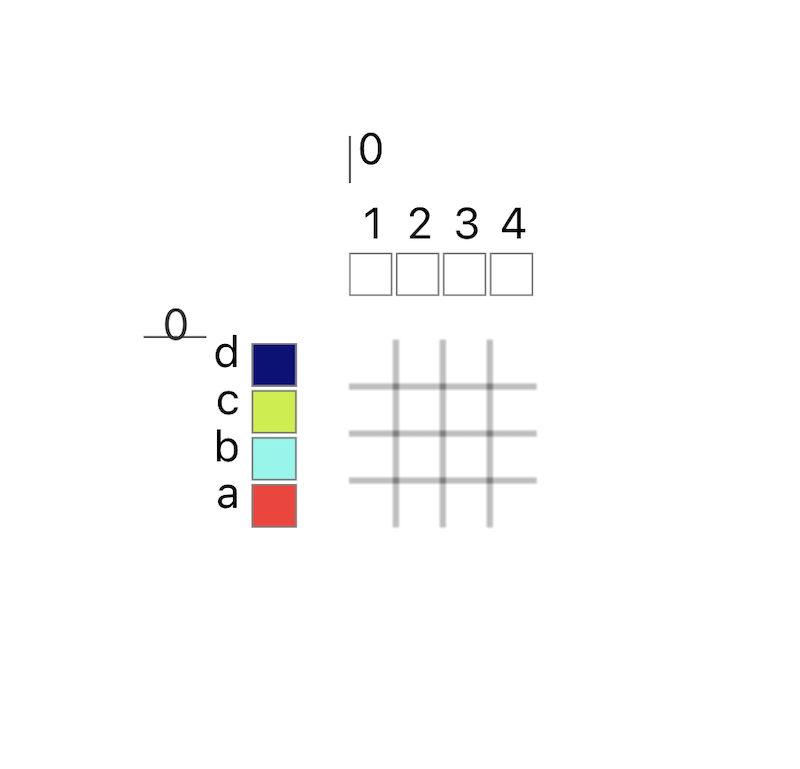
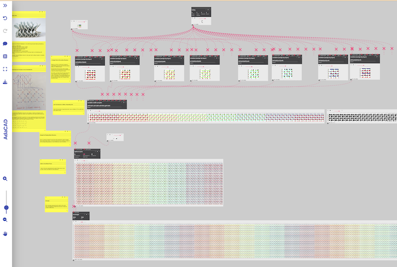
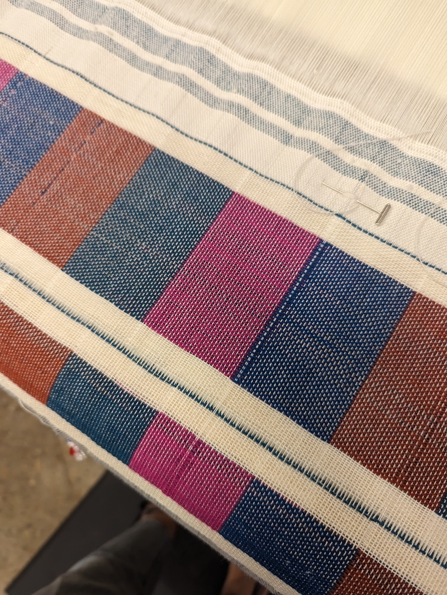
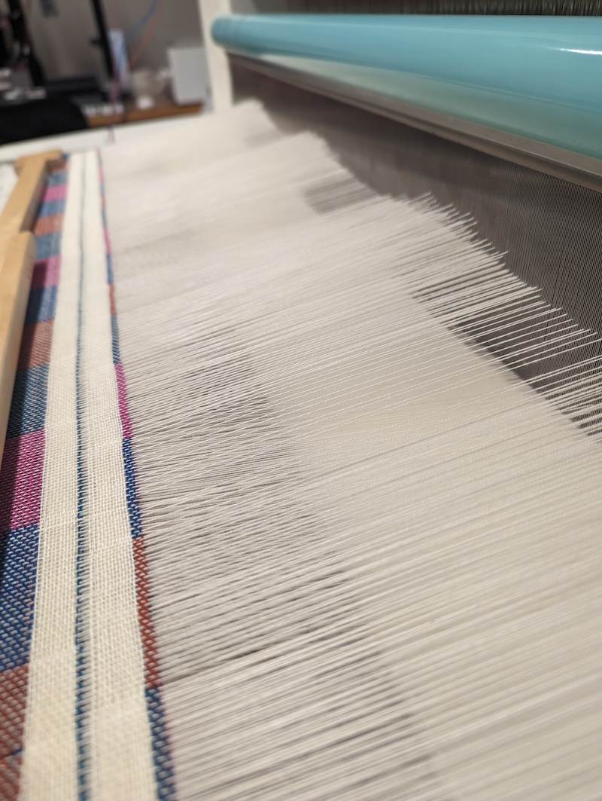
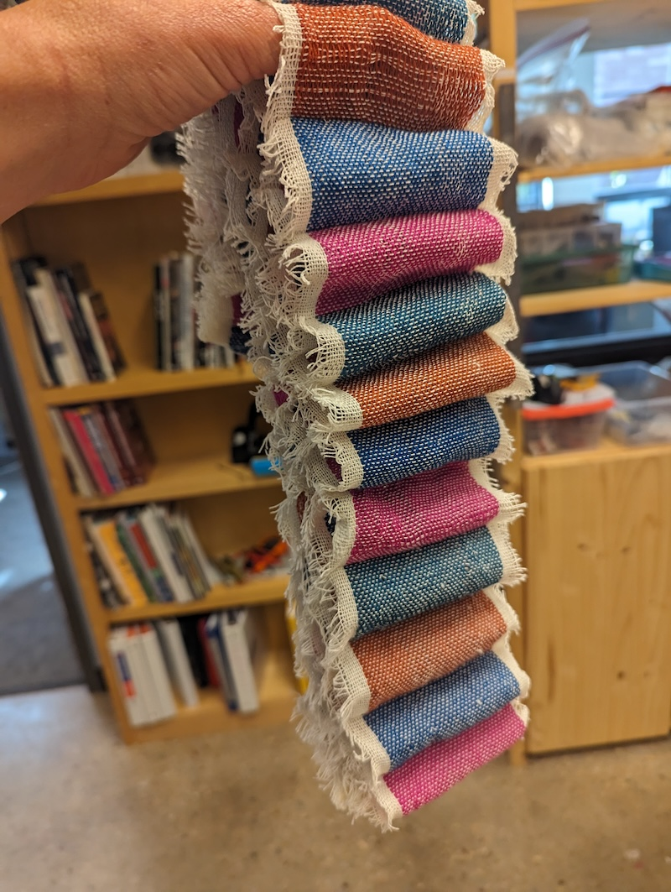
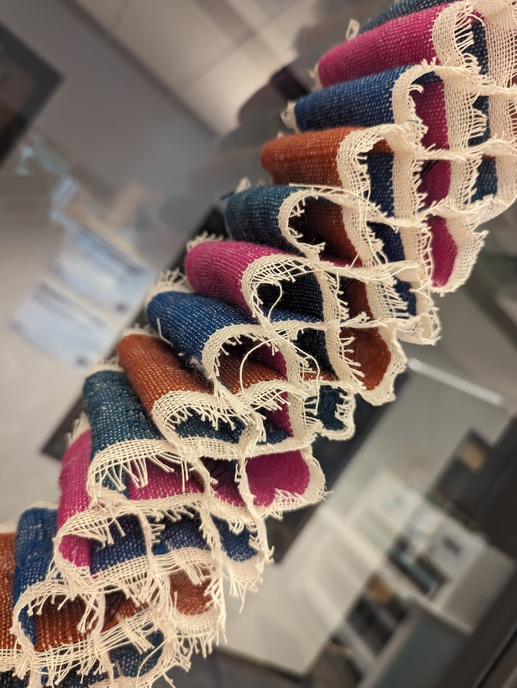

# Create Lattice Structures Using Layer Notation

:::tip

Follow along with this example in AdaCAD 4: [Lattice Structures](https://adacad-4-1.web.app/?ex=sample7b)

:::

In this tutorial, we are taking inspiration from one of Elizabeth Meiklejohn's samples from the [2023 Experimental Weaving Residency](https://unstable.design/2023-residency-in-review/). In this sample, four layers interlock to create a lattice structure. Elizabeth wove in Elastic floats between layers to pull the ends together and puffing up the structure. The elastic also allows you to pull out the sides to collapse the structure. 

The original design was made with the following materials: 

4-layer lattice with elastic floats
- Techniques: multi-layer, shrinking floats
- Weft 1 (w1): 200 tex bonded nylon
- Weft 2 (w2): black elastic
- Base: plain weave in w1, 15 epi per layer
- Floats: w2 running through the center of the layer stack, not interlacing with anything. 

 Elizabeth designed the structure in PointCarre, and we explored how we might make the same structure in AdaCAD using the `layer notation` [operation](/docs/howtouse/glossary/operation) and offer it to this audience for reference and play. 
 
 
 # Understanding the Structure

 
 
 Each layer in the lattice structure follows the path of a sine wave. We visualize the lattice by drawing multiple sine waves (in this case 4), and overlaying the waves so they are equally spaced. In math language, this movement is called a phase shift. This overlapping creates lattice and when we weave it, we can imagine each wave as a different [weft system](/docs/howtouse/glossary/weft-system) traveling between different layer groups. THe openings in the lattice are formed by the intersections/crossing of sine-waves/weft-systems. If you look closely, you see that 'a' follows the exact opposite path of 'b', and 'c' follows the opposite of 'd'.

 If we see the structure as these sine waves, we can start to imagine every wave being created from a [weft system](/docs/howtouse/glossary/weft-system) of a unique color. As it travels from left to right, the weft travels up and down the layers stack (e.g. a term we use to describe the layers in cloth from top to bottom). For example, if we are looking from top to bottom along the leftmost vertical line in the diagram, we see that the layer stack has weft 'a' on top, 'd' next, then 'c', then 'b'. So the layer stack goes 'a-d-c-b'. If we want to recreate this structure in the woven form, the question then becomes, how many different layer stacks are there in one repeat of the sine wave lattice? If we place these stacked layer structures side-by-side along the width of the cloth, we should be able to recreate this cross section. 

As we look left to right in our diagram, we see that there are exactly 8 different layer stacks before they start to repeat. Now, we can use the layer notation operation to create drafts for each of these 8 layer stacks. 

## Understanding Layer Notation
Layer notation emerged as an operation in conversation with Kathryn Walters, who needed AdaCAD to help her manage complex structures that could arbitrarily map warp and weft systems to different layers, layer orders, or even different numbers of layers (e.g. a structure that goes from 2 to 4 to 3 layers for instance.) Beyond her immediate needs, we found it to be a useful system for describing the relationship between different cloth layers. You can learn more about it on the [layer notation](/docs/howtouse/glossary/layer-notation) page in our glossary.

To use the Layer Notation Operation, you must first tell the operation the relationship between different warp and weft systems in your cloth. 

This is what we call a "systems" draft and its created by making a blank draft, opening it in detail view by clicking the magnifying class at the top of the draft, and then manually assigning each warp and weft to a system (and a material just to help us visualize the systems).

You make the draft the size of the smallest repeat. For instance, if you want the warp systems to repeat across the ends 1-2-1-2-1-2-1-2.... and so on, you only need to make the systems draft 2 ends wide, because the smallest repeating unit in that pattern is 1-2. 

As a rule of thumb, when I work with multiple layers, I create as many warp systems as there are layers. Since we are working with four layers in this draft, I create the warp system pattern 1-2-3-4. Since each sine wave will made using one weft system, I create four weft systems as well (a b c d)

### Mapping our Diagram Into Layer Notation
To describe this structure to AdaCAD, we need to create each of the 8 layer orders that repeat in the lattice structure.  We can now import this data into the `Layer Notation` operation in AdaCAD, using one layer notation operation for each unique layer ordering. This allows us to define the warp and weft system, as well as the structures to place upon each layer (in this case, all tabby). 

For example, the first, left most, region would be notated as (a1)(d2)(c3)(b4). This means that there are four layers. On the first, top, we will be weaving tabby on weft system a and warp system 1; on the second, we’ll be weaving tabby on weft system d and warp system 2…and so on. AdaCAD uses this information to generate the draft, and we verify it is in the correct order by using the draft detail view in AdaCAD Beta. This view gives us a simple simulation of how the layers will stack and the structures on each layer. 

As we work across the structure, mapping the different layer orders into notation, we generate 8 different layer notation operations with 8 different orderings (from left to right): 

- (a1)(d2)(c3)(b4)
- (a1)(c2)(d3)(b4)
- (c1)(a2)(b3)(d4)
- (c1)(b2)(a3)(d4)
- (b1)(c2)(d3)(a4)
- (b1)(d2)(c3)(a4)
- (d1)(b2)(a3)(c4)
- (d1)(a2)(b3)(c4)

The layer notation generates an inlet for each layer group, upon which we can apply our structure of choice, which was tabby in this case. What was magical and unexpected (but makes sense!) is how the movement of layers creates different color gradations in the drafts...revealing a gradient across the color spectrum. 

### Placing the Structures Side-by-Side
After generating structures for each unique layer stack in the lattice, we used the  `Variable Width Sampler` operation to repeat each structure across a specified number of ends. In this operation, we describe the arrangement of structures across the width of the cloth in text. We assign each draft we'll input a letter, and follow it by a number representing the number of ends upon which that structure will repeat. For this sample we used: a64 b64 c64 d64 e64 f64 g64 h64

This created 8 inlets for each of our layer stacks and repeated each of them across 64 wefts (roughly 1" in our loom). 

### Splicing in Elastic Between Layers 2 and 3
We needed to float elastic between layers 2 and 3 in order to make the structure expand and contract. We did this by using the `Splice in Pics` operation. Specifically, we created a single structure that lifted warps 1 and 2, and left warps 3 and for 4 and inserted it into our structure every 8 picks. Why 8 picks? We though inserting it every 4 would be too much, so we spaced it our. 

### Making a TC2 Draft
We created a draft for our loom using the `Rectangle` function. We set the ends to the number of ends on our loom (2600) and the number of picks to the same number generated from our input draft (144). We then hit "download" on this draft to produce a bitmap image (though, as a .jpg file), opened it Photoshop, converted it to a bitmap and saved it as a .tiff for production on our loom. 

## It Worked!

We wove it with four colors (one for each weft system) using a thin wool. 

Here's some shots on loom: 

What I loved is somehow the TC2 just happened to raise heddles at different heights....with patterns that looked like sine waves. 

The results were squishy and delightful. 

