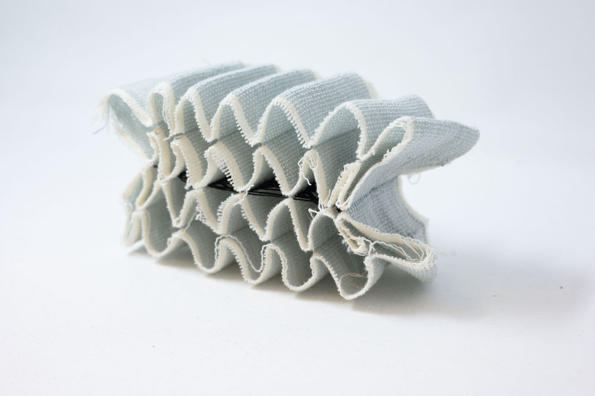
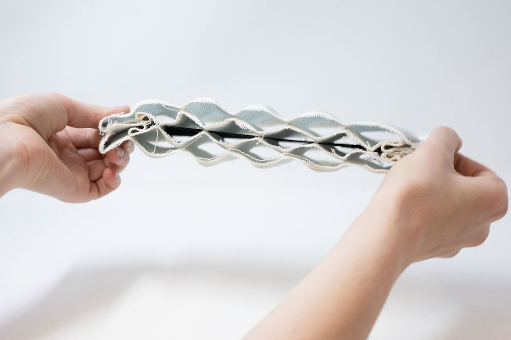
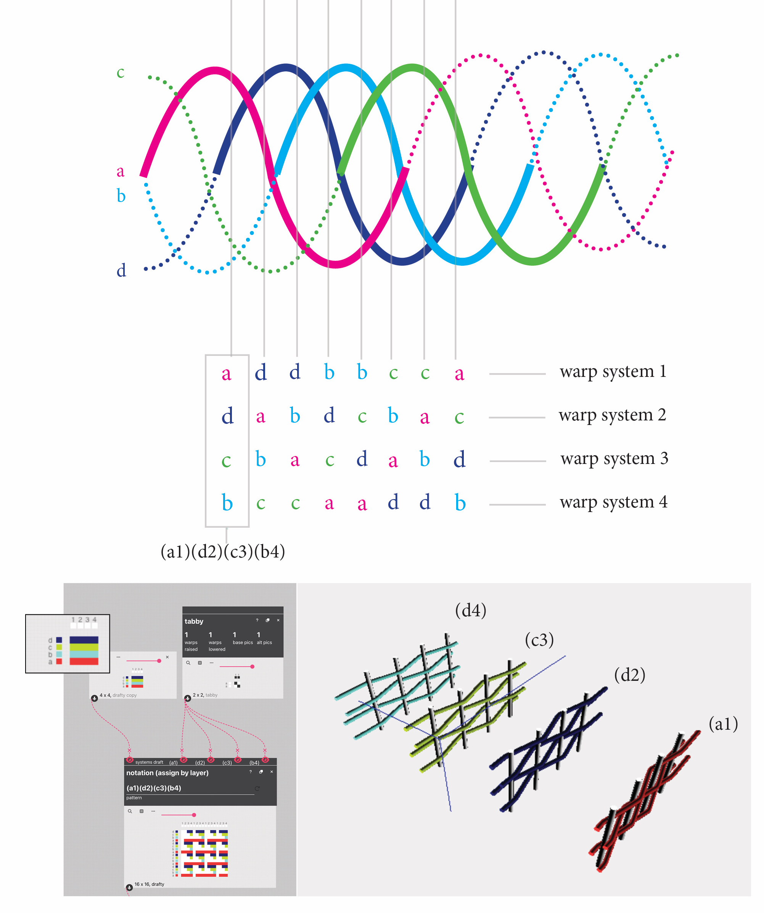
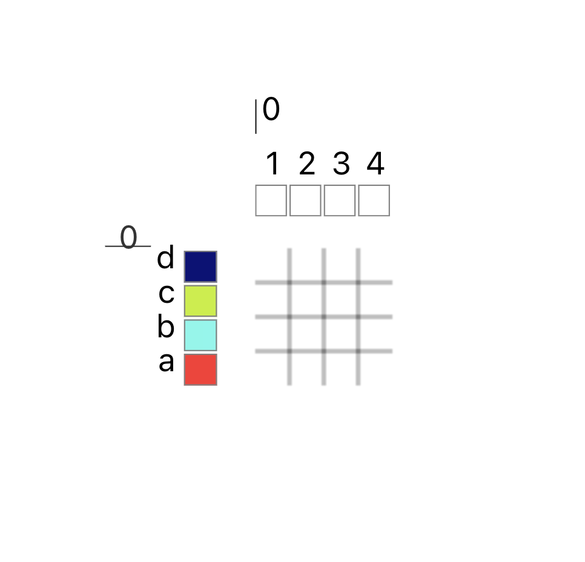

# Creating Lattice Structures With AdaCAD
In this tutorial, we are taking inspiration from one of Elizabeth Meiklejohn's samples from the 2023 Experimental Weaving Residency. In this sample, four layers are interlocking to create a lattice structure. Elastic foats are placed between the layers to pull the ends together (puffing up the structure), allowing you to pull out the sides to collapse the structure. 

The original design was made with the following materials: 

4-layer lattice with elastic floats
- Techniques: multi-layer, shrinking floats
- Weft 1 (w1): 200 tex bonded nylon
- Weft 2 (w2): black elastic
- Base: plain weave in w1, 15 epi per layer
- Floats: w2 running through the center of the layer stack, not interlacing with anything. 

 Elizabeth designed the structure in PointCarre, and we explored how we might make the same structure in AdaCAD using the layer notation feature and offer it to this audience for reference and play. 
 
 
 # Understanding the Structure

 
 
 Each layer in the structure follows the path of a sine wave, following the path of a mountain or a valley such that if we repeat the curve, it forms one long continuous up and down path. We repeat this structure once for each layer, and each time we add another sine wave, we shift it a little bit to the right (in math language, we perform a phase shift). This overlapping creates lattice, where by different cells or openings in the lattic are formed by the intersections/crossing of sine-waves/layers. If you look closely, you see that a follows the exact opposite path of b, and c follows the opposite of d.

 If we see the structure as these sinewaves, we can start to imagine every wave being created from a single weft of a unique color. As it travels from left to right, the weft travels up and down the layers stack (e.g. a term we use to describe the layers in cloth from top to bottom). For example, if we are looking from top to bottom along the leftmost line in the diagran, we see that the layer stack has weft a on top, d next, then c, then b. So the layer stack goes (adcb). If we want to recreate this structure in the woven form, the question then becomes, how many different layer stacks are there in this structure? If we place these structures side by side along the width of the cloth, we should be able to recreate this cross section. 

As we look left to right in our diagram, we see that there are exactly 8 different orders for the layer stack before they start to repeat. Now, we can use the layer notation operation to create drafts for each of these 8 layer stacks. 

## Understanding Layer Notation
Layer notation emerged as an operation in conversation with Kathryn Walters, who needed AdaCAD to help her manage complex structures that could arbitrarily map warp and weft systems to different layers, layer orders, or even different numbers of layers (e.g. a structure that goes from 2 to 4 to 3 layers for instance.) Beyond her immediate needs, we found it to be a useful system for describing the relationship between differet cloth layers. 

To use the Layer Notation Operation, you must first tell the operation the relationship between different warp and weft systems in your cloth. 

This is what we call a "systems" draft and its created by making a blank draft, opening it in detail view, and then manually assigning each warp and weft to a system (and a material).

You make the draft the size of the smallest repeating. For instance, if you want the warp systems to repeat across the ends 1-2-1-2-1-2-1-2.... and so on, you only need to make the systems draft 2 ends wide, because the smallest repeating unit in that pattern is 1-2. 

As a rule of thumb, when I work with multiple layers, I create as many warp systems as there are layers. Since we are working with four layers in this draft, I create the warp system pattern 1-2-3-4. 

For wefts, I consider how many different paths the weft I am also assigning each weft a system and a color, 

To describe this structure to AdaCAD, we drew out the sine waves, assigning each wave a “weft system” id of a,b,c, or d. The layer notation features allows the user to specify the warp and weft system patterns for our draft, to assign drafts to different weft and warp systems, and then to describe which of those weft and warp systems sit on each layer. If we imagine the cross-section as overlapping sine waves, we see how the layers swap places at several intervals in the structure. We then define the order of the weft systems, by layer, from top to bottom in each section. Since we’re using four layers, we also define four warp systems, one for each layer. We can now import this data into the “Layer Notation” operation in AdaCAD, using one layer notation operation for each unique layer order. This allows us to define the warp and weft system space, as well as the structures to place upon each layer (in this case, all tabby). 

For example, the first, left most, region would be notated as (a1)(d2)(c3)(b4). This means that there are four layers. On the first, top, we will be weaving tabby on weft system a and warp system 1; on the second, we’ll be weaving tabby on weft system d and warp system 2…and so on. AdaCAD uses this information to generate the draft, and we verify it is in the correct order by using the draft detail view in AdaCAD Beta. This view gives us a simple simulation of how the layers will stack and the structures on each layer. 

