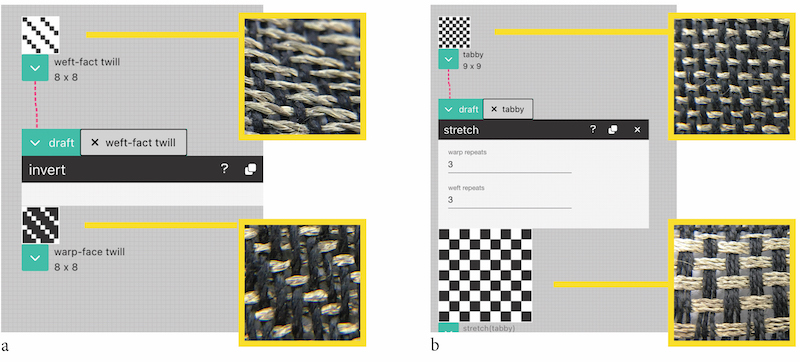
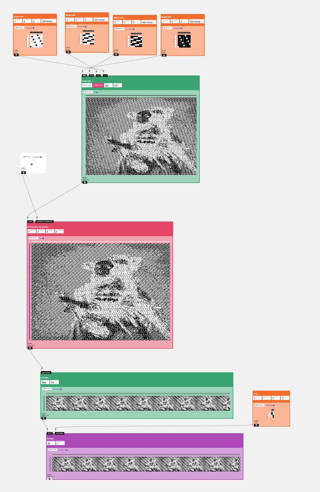
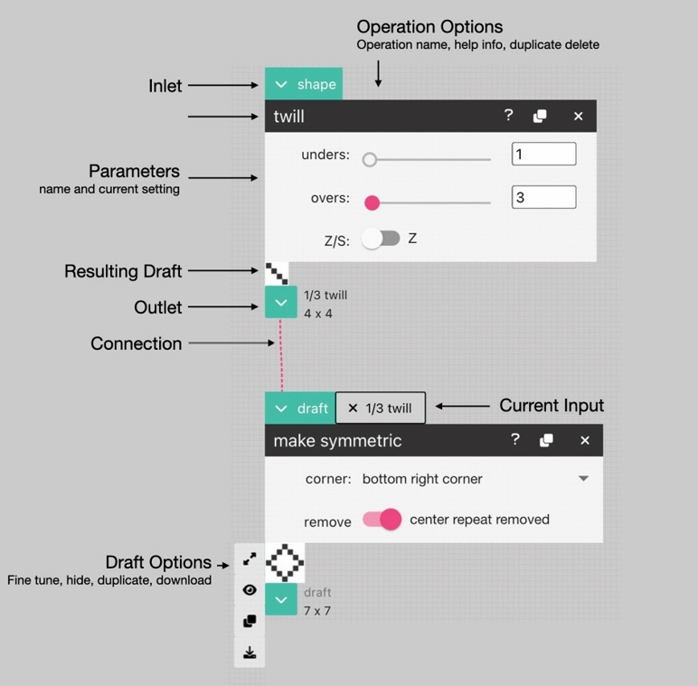

# Make a Dataflow

One way that you can generate drafts in AdaCAD is by making dataflows. You create dataflows by chaining different AdaCAD [operations](../../reference/glossary/operation.md) together. So, rather than clicking or coloring in grid cells to represent woven structures, AdaCAD lets you describe a structure algorithmically, as a dataflow. This process might be unusual for many but it offers the ability to be playful (e.g. randomly chain things together and see what kinds of structures they make) or, to encode complex structures in ways that help make the logic understandable and easily adjustable to different looms or yarns. 

## Understanding Operations

The dataflow approach to drafting emerged when we noticed that we, and other weavers, were implicitly performing algorithmic design and programming. However, instead of making computer code that compiles to a particular system and  generates automated programs, weavers make drafts that compile to different kinds of looms and materials and generate  cloth. 

One example of a simple algorithm performed by weavers is what we call, *invert* (shown above in example a). *Invert*  changes all the black cells in a draft to white and vice versa. Weavers often perform this operation when working with unbalanced structures and contrasting colors in the warp and weft. In these cases "inverting" the draft has the effect of making the warp or weft color more dominant in a region of the cloth. 

Another example is a *stretch* operation (shown above in example b), which repeats each interlacement across a user-specified number neighboring of warps and wefts. A weaver might do this if they find that their cloth is not weaving square (e.g. it's building more in the length then width). They can correct this imbalance by adding warp repeats, effectively stretching the structure across the width so it can square up with the height. AdaCAD contains dozens of operations to do common and unusual things to drafts. Behind the scenes, each operation implements computer code that describes how to change the draft (and if you are code savvy, [you can write your own](../../develop/makeanoperation.md)). 

## Chaining Operations into a Dataflow

The image above shows a dataflow created using the AdaCAD workspace. In this image, you can see a series of [operations](../../reference/glossary/operation.md) chained together. Some [operations](../../reference/glossary/operation.md) (such as the *twill* operation shown on the top left), generate families of structures that follow particular rules. Other [operations](../../reference/glossary/operation.md) (such as *make symmetric*, top right) take a draft as input, manipulate it in a particular way, and then return the manipulated draft. By chaining (e.g. connecting the [outlet](../../reference/glossary/outlet.md) of a draft to the [outlet](../../reference/glossary/inlet.md) of an operation) drafts and operations together, you grow a virtual draft making machine. Anything you change (e.g. if you were to change your twill at the top), will ripple all the way down the chain. This might take more time to set up, but once set up, it makes it really fast to playfully change values, see what is happening, or make edits to the design and dataflow. What we find exciting about this dataflow is that is allows us to see, side-by-side, how different color combinations in the warp and weft will lead to very different visual patterns even though the cloth structures are the exact same.

## Follow the Video
The video below shows this in action, and in detail, using AdaCAD 4

<iframe width="560" height="315" src="https://www.youtube.com/embed/kqIYEEV04kM?si=9pgVrze9bFJbVu4K" title="YouTube video player" frameborder="0" allow="accelerometer; autoplay; clipboard-write; encrypted-media; gyroscope; picture-in-picture; web-share" allowfullscreen></iframe>

## Terms and Interface Elements

While you can find more information on the terms [operations](../../reference/glossary/operation.md), [parameter](../../reference/glossary/parameter.md), [inlet](../../reference/glossary/inlet.md), and [outlet](../../reference/glossary/outlet.md) in our [glossary](../../reference/glossary/), the image below gives an overview of the terms and interface elements to which they refer upon on small dataflow.

## Bonus Activities

Still curious about the link between algorithms and draft making? Feel free to [download our paper that describes drafting, structures, and operations in the context of making woven force sensors](../../about/resources/introtoweavestructure.pdf). Pages 3 - 11 include a workbook for people to follow to learn for themselves. 

<iframe width="560" height="315" src="https://www.youtube.com/embed/ZnJwoYrU0WU" title="YouTube video player" frameborder="0" allow="accelerometer; autoplay; clipboard-write; encrypted-media; gyroscope; picture-in-picture; web-share" allowfullscreen></iframe>

