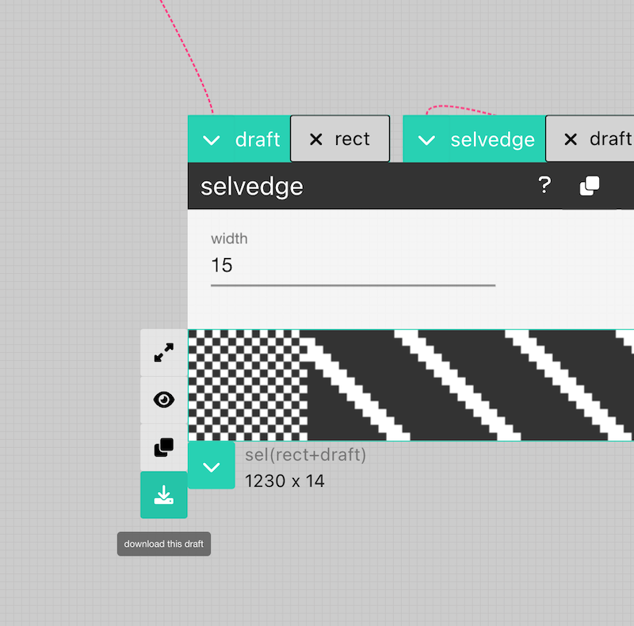
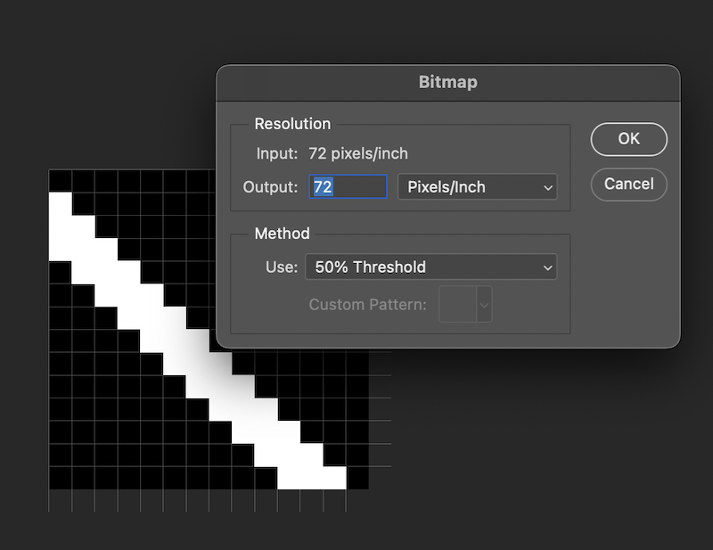

# Weave AdaCAD Drafts

You can weave the drafts created in AdaCAD on a variety of looms. For analog looms, you might do this directly by viewing the draft page, for computerized looms, you can export AdaCAD files in formats that communicate to different looms. Specifically, you can export bitmaps for weaving on a TC2 and .WIF files for weaving on dobby looms or editing in other softwares that support the .WIF format. The instructions below focus specifically on exporting drafts from AdaCAD so you can weave them on a [TC2](#weave-drafts-on-a-tc2) or [AVL Compu-dobby loom](#weave-drafts-on-an-avl-compudobby-loom). 

# Weave Drafts on a TC2

import Tabs from '@theme/Tabs';
import TabItem from '@theme/TabItem';

<Tabs>
  <TabItem value="adacad4" label="AdaCAD 4" default>
        In AdaCAD 4, we are able to download bitmap images that can be directly loaded onto the TC2 (e.g. no need to convert the file format in Photoshop). The video below walks you though this process. 

        <iframe width="560" height="315" src="https://www.youtube.com/embed/zrmt8_4p7y4?si=Y4TSVZ82WfKvN4GE" title="YouTube video player" frameborder="0" allow="accelerometer; autoplay; clipboard-write; encrypted-media; gyroscope; picture-in-picture; web-share" allowfullscreen></iframe>  

Video Summary: 

0. Create a draft or dataflow that matches the size of your loom (e.g. as many ends as your loom is configured to weave and as many pics as you need to complete the cloth.)
1. Download the draft you'd like to weave by double-clicking the draft and selecting "Download as Bitmap". This will save a bitmap where-ever your computer stores downloads from the web in a .jpg format. 
2. Open this file using the TC2 software. When it prompts you that your file has "More than 2 colors in Pattern". Push the "Bilevel" button. 
3. Start weaving. 

</TabItem>

<TabItem value="adacad3" label="AdaCAD 3">
    
        ### Step 1: Download the Bitmap From AdaCAD

        

        You can download the draft by hovering your mouse over the [outlet](../../reference/glossary/outlet.md) of the draft you'd like you download and select "download as bitmap." The bitmap exported from AdaCAD uses a .jpg format (because we haven't figured out a way to download directly to BMP or TIFF just yet). You need to formally convert the .jpg that AdaCAD generates to a bitmap format for it to be read, which we show in the next step.

        ### Step 2: Reformat as a .TIFF file in Photoshop

        Each draft created in AdaCAD can be exported as a bitmap image, however, the files exported need to be processed to be converted into true bitmap that can be read by the TC2. This can be accomplished by opening the bitmap generated by AdaCAD in Photoshop, selecting Image->Mode->Greyscale:

        

        Then, selecting Image->Mode->Bitmap. Selecting the bitmap mode will ask you to agree to flatten layers (say OK), then will give you options for resolution. Set resolution to the automatic value (72 Pixels/Inch) and then for the "Method" category, select "50% Threshold". This will take any pixel that is more than 50% black, and make it black, and any that is less than 50% black, and make it white. 

        

        Then hit "Save As" and select "TIFF" as the format and you are ready to use this file on your TC2. 
  </TabItem>
</Tabs>

# Weave Drafts on an AVL Compudobby Loom

You are able to download .WIF files that can be directly uploaded onto our AVL CompuDobby Loom TC2. The video below walks you though this process. 

<iframe width="560" height="315" src="https://www.youtube.com/embed/nhHUUaMHx_Y?si=PJdnXeZRILSegAMb" title="YouTube video player" frameborder="0" allow="accelerometer; autoplay; clipboard-write; encrypted-media; gyroscope; picture-in-picture; web-share" allowfullscreen></iframe>

# Support for other Kinds of Looms

Are you interested in using AdaCAD to draft for looms we have not listed here? Feel free to let us know by emailing us at unstabledesignlab@gmail.com

