# Color Blending via Layers

Generate a workflow that uses layers and structures to support color blending in warp and weft. 

## What You'll Need
- An indexed color image. If you don't have one handy, you can download the one from this example [here](./img/experiment_wavy_sized.png)
- A blank workspace at [adacad.org](https://adacad.org). 

## Concept

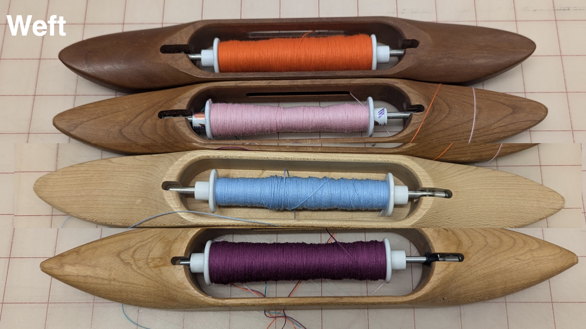

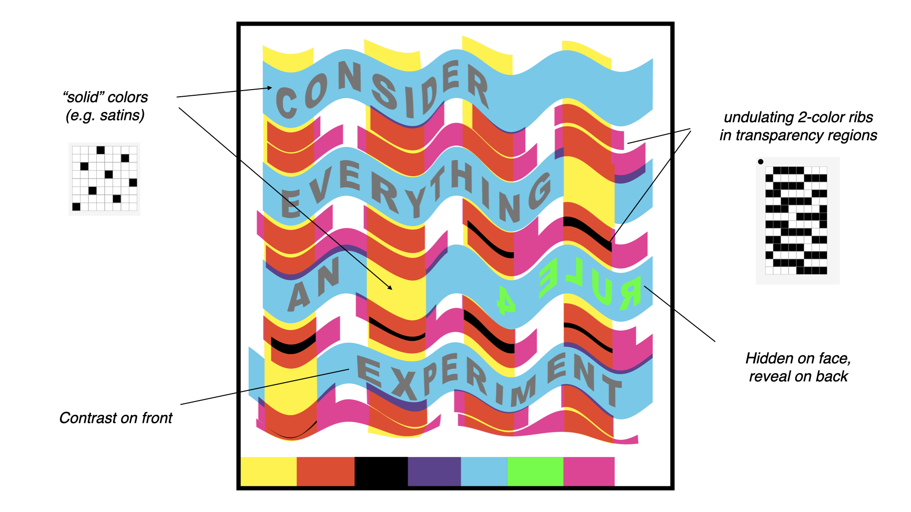

We have a multicolor warp and we want to create some color-blending experiments and map them into different regions of an image. We're going to use 4 wefts in different colors so that we can mix them with the warp to widen the range of colors in the resulting weave. Our approach to color blending is going to use 2 layers, with front facing colors on the top layer, and colors for the back on the back layer. 

We're going to use the [`layer notation`](../../reference/operations/notation.md) operation to create our layers and to manage which colors are visible on each of the faces. To do this, we need to provide the layer notation operation with information about your warp and weft systems (step 1 below), a text string that represents how the layers will form (step 2 below), and then the structures that will be applied to each layer (step 3 below). 

## Process

### 1. Define Warp and Weft Systems via a Systems Draft###
 One way to work with multiple warp and weft colors and layers in AdaCAD is to think of the warp and weft in terms of [systems](../../reference/glossary/system.md). By assigning individual warp end or weft pick to a system, we can define group of warps or wefts that will work together in the draft. We can then supply this information to certain operations, like [`layer notation`](../../reference/operations/notation.md), which will create drafts based on how you want to organize those systems into layers. We provide this information to the operation in the form of a systems draft: a draft that specifies the sequence in which systems and materials that will be used to generate the outcome. 

#### Warp Systems Approach
In our example, we will use warp systems to map to the different colors that we are alternating in our warp and then, subsequently, to control which of those warp systems will form the top layer. 

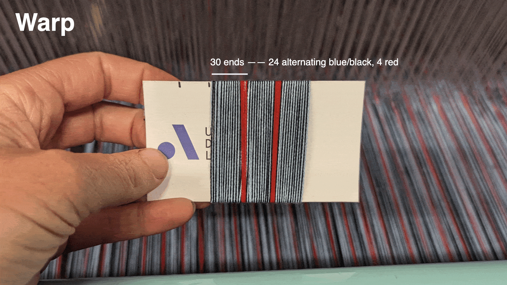

To do this, we can think of each black end as belonging to system 1, and each blue end to system 2. In the red regions we will continue to repeat the 1, 2 sequence (though we could theoretically create system 3 for red, we'll just keep it simple and stick to 1 and 2 in this tutorial). When we define this in the systems draft, we don't need to assign every warp to a system, we just need to describe the minimal repeating unit (outlined in yellow in the gif above)

#### Weft Systems Approach

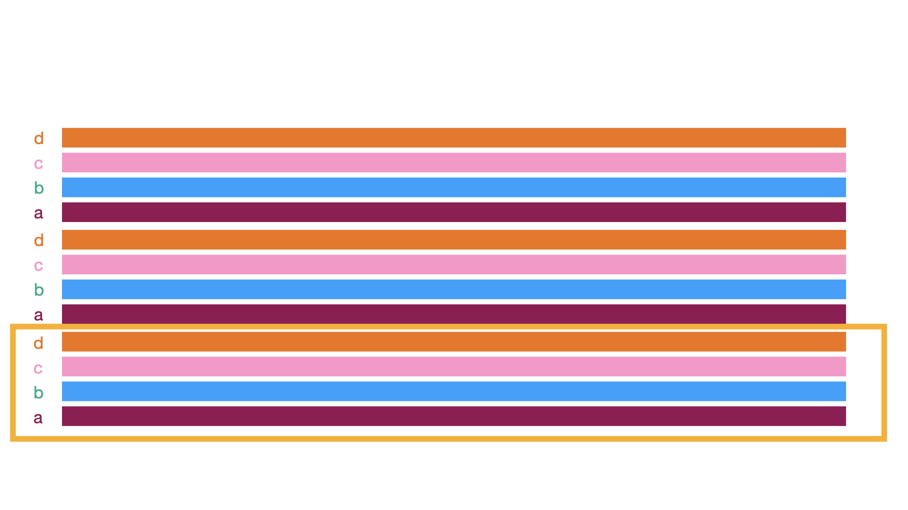
For the weft, we'll plan to keep our weaving process simple by throwing the same sequence of four colors in order (a, b, c, d). We'll assign each weft to a unique system so that we can treat each different colored weft as a group and control which wefts appear on the front face of the cloth. Again, our systems draft should just contain the minimal repeat that we'll apply across the draft (outlined in yellow). 

#### Resulting Systems Draft
Now that we know the general sequence of warp and weft systems and colors, we can use AdaCAD to create the systems draft. To do this we click on [+ <FAIcon icon="fa-solid fa-chess-board" size="1x" /> add draft](../../reference/interface/workspace#a-add-drafts-or-notes-to-workspace) and in the window that pops up, we'll tell AdaCAD that we want to create a draft with 2 warps (to capture the system sequence 1-2- in the warp), and 4 wefts (to capture the system sequence a-b-c-d- in the weft). 

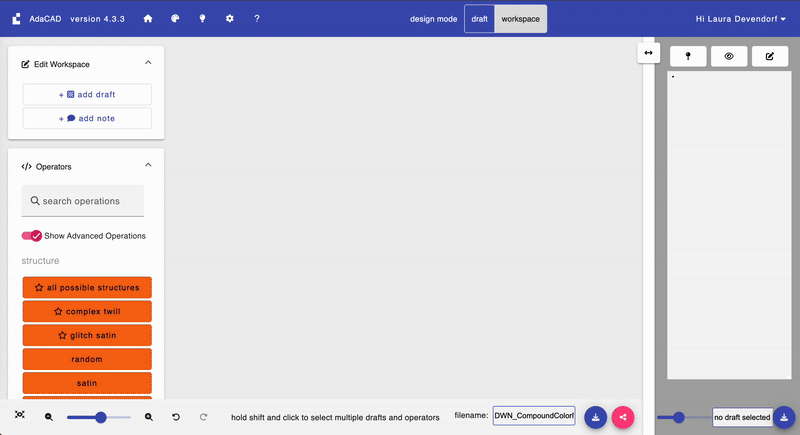

After adding your warp and wefts, and selecting 'OK', AdaCAD will drop a new blank draft onto the workspace. To edit this draft in more details, double-click it and then select **“open in editor”** 

And voila, you’ll see the draft in the draft editor. I prefer to set my  [loom type, which can be adjusted in the left sidebar](../../reference/interface/draft_editor.md#c-adjust-loom-and-draft-settings), to “Jacquard” so the view is simple. Then, and then [select a color from the drafting pencil tab](../../reference/interface/draft_editor.md#changing-systems-and-materials). 
 
If you click the colored squares on the warp with this colored pencil, you’ll assign that color to the respective warp.  Repeat the process for each color in your sequence. 

Now it’s time to assign the systems. You see the little numbers above the colored warp boxes? Those define the system to which this warp belongs. Click on the number to increment up to the next available warp system number. 

Repeat the exact same process along the weft until your completed warp and weft system template draft looks like this:

Now, toggle back over to the workspace (remember, you can do this by hitting the “workspace” button next to “design modes:” in the [top bar](../../reference/interface/topbar) to view the draft you just created and get ready to connect it into other operations. 

### 2. Add the Layer Notation Operation ###
Select or Search for the [`layer notation`](../../reference/operations/notation.md) operation from the list of operations on the left sidebar. If it is not showing up, make sure "Show Advanced Operations" is selected. After you select the operation, it will be added into your workspace. Connect the [ <FAIcon icon="fa-solid fa-circle-arrow-down" size="1x" /> outlet](../../reference/glossary/outlet.md) of your systems draft and connect it to the "systems draft" [ <FAIcon icon="fa-solid fa-circle-arrow-down" size="1x" /> inlet](../../reference/glossary/inlet.md) on the layer notation operation. 

Now, we need to tell the layer notation operation which warp and weft systems we're going to use on the top and bottom faces of the cloth. We do that by providing a text string that specifies how to group warp and weft systems in it's "pattern" parameter. If you'd like to understand this more deeply, you can read about it on the [layer notation glossary page](../../reference/glossary/layer-notation.md), otherwise we'll walk you though an example below. The pattern string in the image tells layer notation that it's going to use wefts a and b, and warp system 1 as the top layer, and wefts d and c and warp system 2 on the bottom. 

Lets unpack how we got there: 

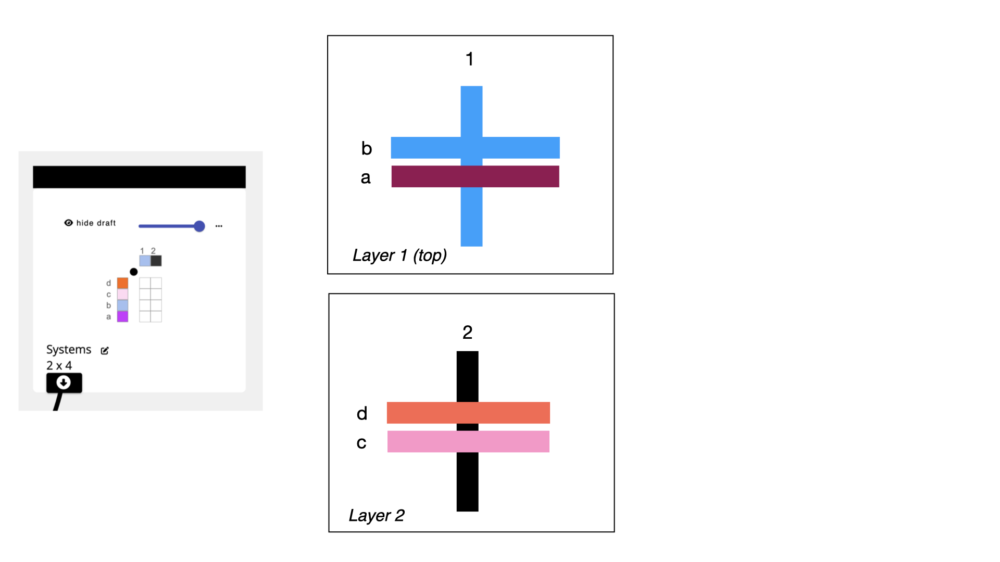

Before we write this text string, we can just think about how we want our colors to be arranged. Lets say that we are going to want the blue and purple wefts and the blue warp on the top layer, and the remaining wefts and warps on the bottom layer (as shown in the image above). 

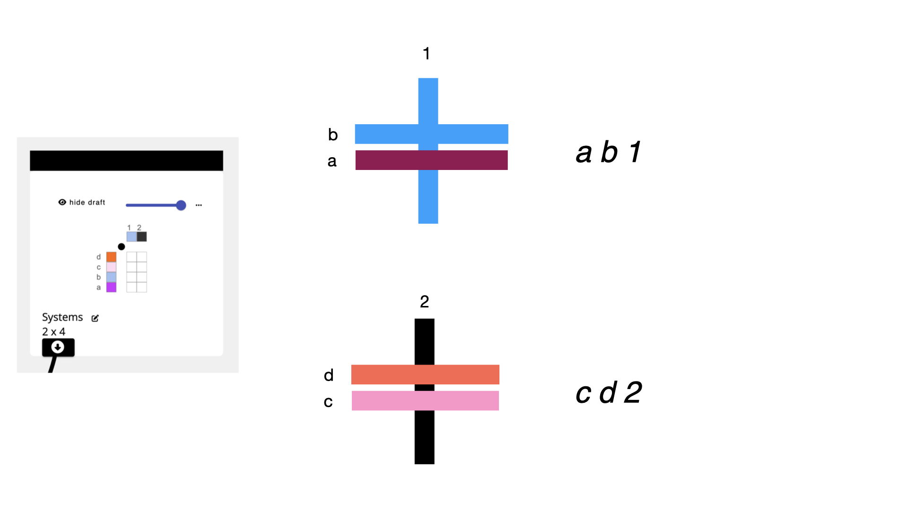
We can think about those relationships in terms of their systems. So, our top layer would include warp system 1 and weft systems a and b. Our bottom layer would be comprised of warp system 2 and weft systems c and d. 

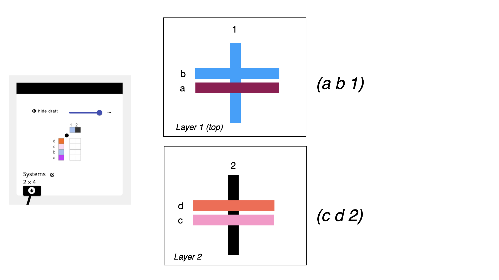
When we want to tell layer notation that something is a layer, we wrap it in (parenthesis). So, by wrapping those system lists in (), we mark them as two distinct layers. 

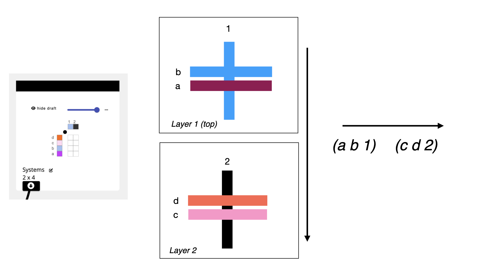
While we think of layers as forming on the top of the cloth and progressing towards the back of the cloth, we have to format things in AdaCAD from left to right. So, we just copy our text such that the top layer is the left-most unit in the text, and the bottom layer is the right most. This will apply if you are using 2 or 10 layers: left is front face, right is back face.  

When we give the string `(a b 1)(c d 2)` to the layer notation operation, and hit the little <FAIcon icon="fa fa-refresh" size="1x" /> refresh button, you'll see that it pops up two new [ <FAIcon icon="fa-solid fa-circle-arrow-down" size="1x" /> inlets](../../reference/glossary/inlet.md), each of which contains one of your layer groups.

### 3. Assign Structures to Layers ###
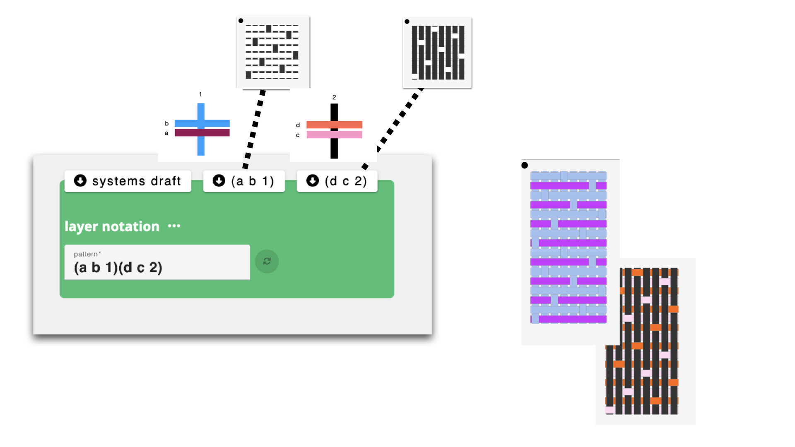

Now it's time to assign structures to the different layers in our cloth. In this example I'm going to be making a sample that uses satin on both layers I'm going to map a weft-facing satin to the top layer and a warp facing satin to the back face. 

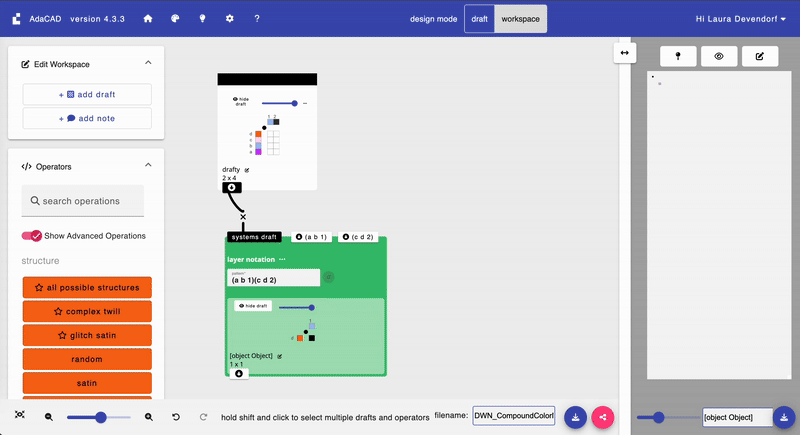
To do that, we select [`satin`](../../reference/operations/satin.md) from the operations list to add it to the workspace. We then update the satin parameters to match my needs. Connect the [ <FAIcon icon="fa-solid fa-circle-arrow-down" size="1x" /> outlet](../../reference/glossary/outlet.md) of your satin draft and connect it to the [ <FAIcon icon="fa-solid fa-circle-arrow-down" size="1x" /> (a b 1) inlet](../../reference/glossary/inlet.md) to assign that satin structure to the systems that comprise the top layer. I repeat the process for the (c d 2) inlet, though, I use a different face on the satin. We can use the [viewer](../../reference/interface/viewer.md) to better understand the structure that has been created. 

### 4. Repeat to Make Different Variations ###
The layer notation operation computes all the information so that those structures will map onto those layers and the warp will lift in ways that will allow the layers to separate. From here, it's easy to swap out structures, or even swap which colors are on each face just by changing the pattern parameters. 

:::tip
You can view all of the structural variations that I created for this example by loading the example workspace at: [https://adacad.org/?share=98618829](https://adacad.org/?share=98618829)
:::

The images below show all the variations we sampled. Under each image we list the layer notation pattern sequence that was used to control the colors and layers. The structures assigned to those systems varied. 

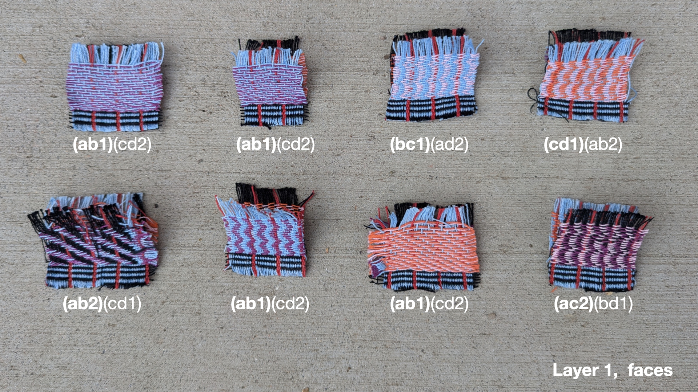

### 5. Sample and Adjust ###

In preparation for using the structures in regions of artwork, I create samplers of all the different structures to understand how they weave and pack. It's not uncommon to notice errors here. For instance, I found that my original structure was building too quickly relative to other structures so I decided to [`stretch`](../../reference/operations/stretch.md) the satin so it would pack the wefts more densely. 

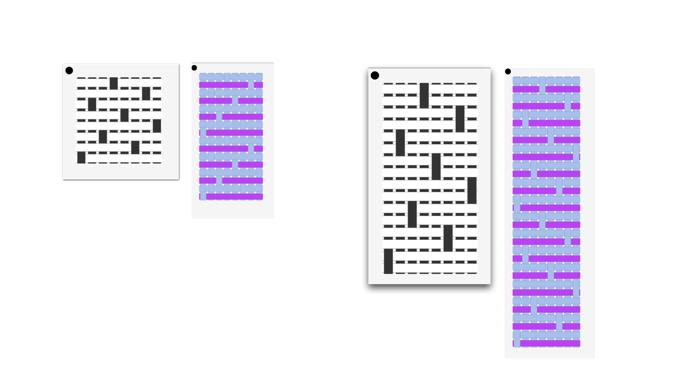

I did that by just popping back into my workspace and adding the [`stretch`](../../reference/operations/stretch.md) operation between the satin and and the (a b 1) inlet on the layer notation. 

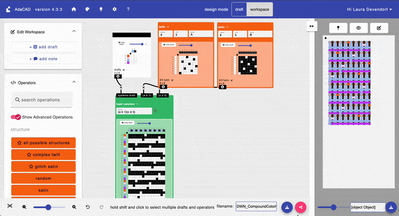

The animation below shows all the layers of the sample we designed in this example, after it had been adjusted. 

### 5. Apply to Imagery and Weave ###
After creating all of the structural variations, I applied each structure to a region to a piece of artwork that I had designed with inspiration from Corita Kent's rules. 

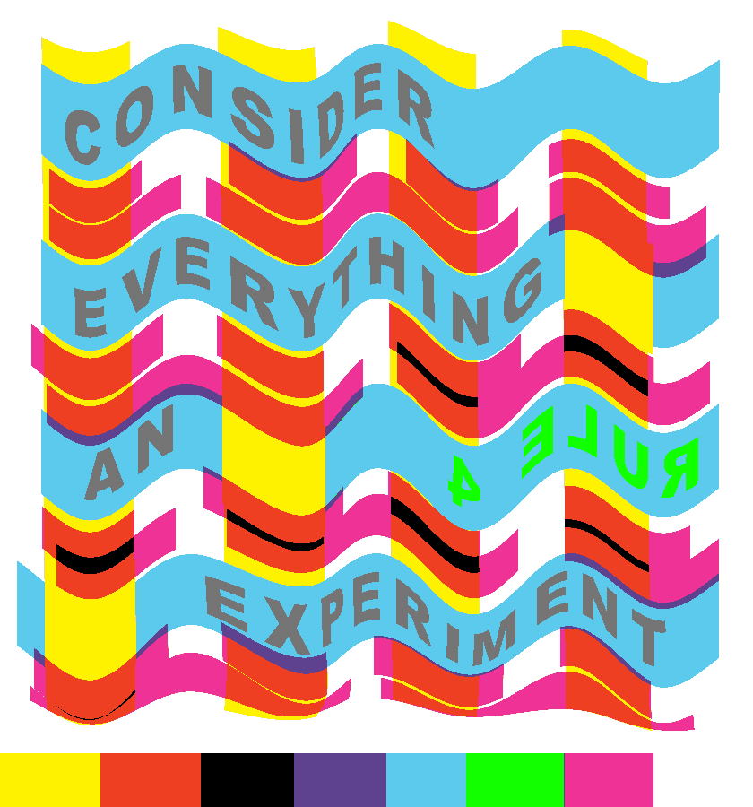
I followed the process outlined in [Weaving Imagery Tutorial](figured_weaving_tc2.md) to assign structures to the color regions of the image and then wove it all on a TC2 following the process outlined in [Weaving on a TC2](weave_tc2.md). You can see in this image that the bottom contains a line of the different colors which I used for sampling the structures prior to creating the entire cloth. 

The outcome is a bit muddier than I would like (I was under a time deadline so I didn't do an iteration on the structures) but overall, I found the play and experimentation to be useful in and of itself. 

