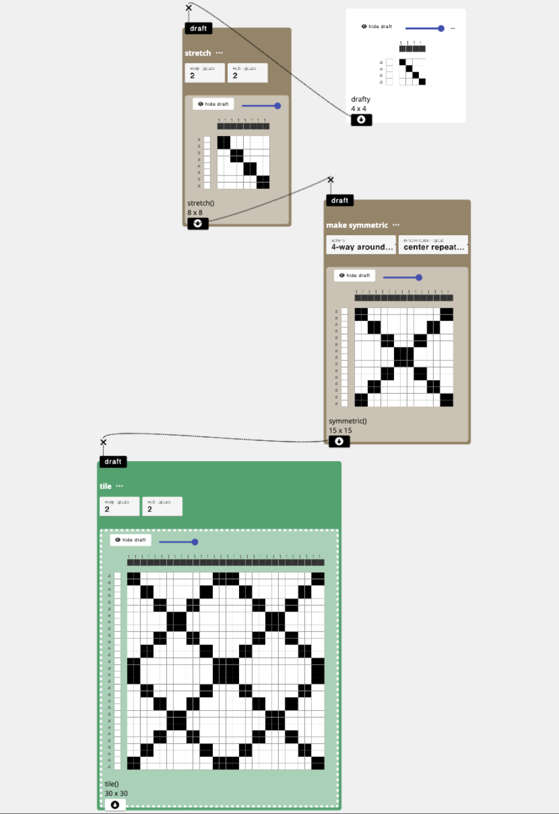

# Dataflow

A dataflow is created when drafts and operations are connected together by selecting the [outlet](outlet) of a draft and connecting it to an [inlet](inlet) of an operation. 

## Chaining Drafts and Operations
This act of connecting creates a relationship that will be maintained even when something in the dataflow changes. 

AdaCAD allows you to chain multiple operations and drafts together. In the example, a draft (which was created in a point-and-click fashion by the user) is connected to the [stretch](../operations/stretch.md) operation which interprets the the parameters (2 and 2) to duplicate each end and pic in the input structure 2 times when creating the output structure. Connecting the outlet of the stretch operation to the inlet of the [make symmetric](../operations/makesymmetric) operation takes the stretched draft and rotates it around whichever corner is chosen from the list on the make symmetric operation. And so on, the output of the make symmetric operation can be connected to the inlet of the tile operation, essentially "stamps" its input draft a user-specified number to the right/bottom of the original. 

## Playing in the Dataflow

It can be helpful to think of the dataflow as a stream that flows through connections. Something that takes place "upstream" in a dataflow modifies what happens to any location "downstream". This is what makes AdaCAD playful. Once a dataflow has been created, it becomes easy to just playfully change inputs and values to see what else might emerge. 

## Editing Drafts Produced in the Dataflow

One of the drawbacks of the dataflow is that you can't just open any individual draft generated by an operation for editing. This is because the draft generated by an operation is only aware of the rules told to it by the operation. There is no way for you, the user, to point and click and add your own rules or modifications on top of that (unless, of course, you'd like to [program your own operation](../../develop/makeanoperation.md))

If you do need to make edits to a draft created in the dataflow you must open teh draft in the editor and hit "Enable Edits" from the top of the screen. This will copy the draft generated by the operation and remove it from the dataflow so you can edit it freely. In this case, your draft will no longer be part of the dataflow and thus, it will not change if the dataflow is changed. 
