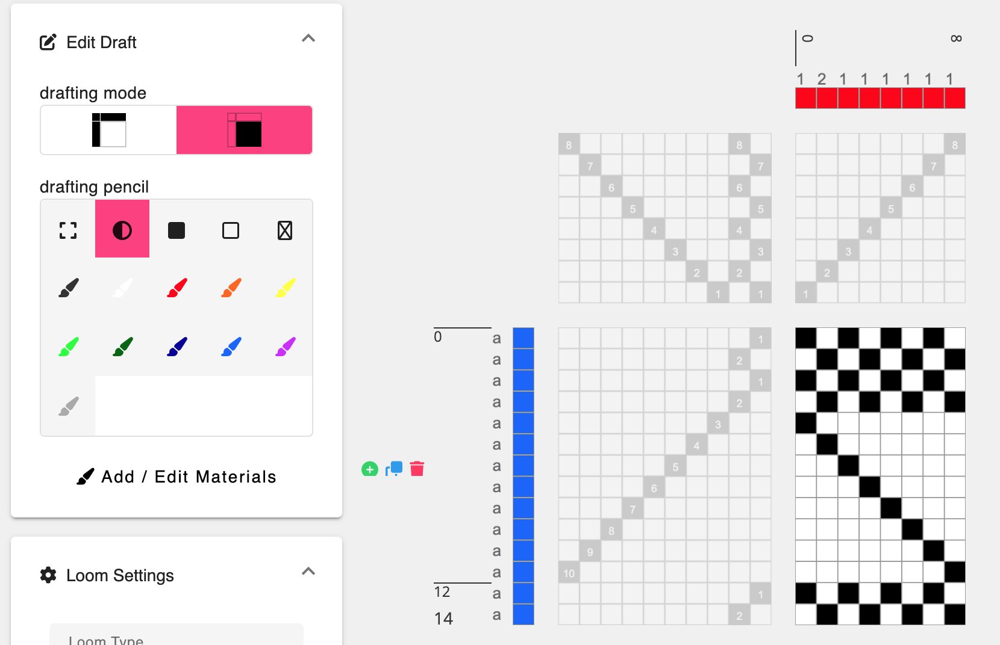

# Drafting Style

Different approaches to drafting are used to plan cloth on different [looms](loom). In this context, we refer to these approaches as "Drafting Styles" and offer support for two different kinds of drafting styles which we call drawdown-first or threading-first approaches. 

## Drafting Style Options Depend on the User Selected Loom
The type of loom that you select in the Draft editor determines your options for drafting. Specifically, if you select [jacquard](./jacquard-loom.md) you will only be presented with the [drawdown](./drawdown.md) to edit and no information about threading, tie-ups or treadling (as we assume that you do not need this information if you are working on a fully Jacquard machine.) If you select any other type of loom ([harness](harness-loom.md) or [direct-tie/dobby](./direct-tie-loom.md)) you will be given the option of the following drafting approaches: 

## Threading-First Drafting
In threading-first drafting, the user will see the threading, tieup, and treadling/lift-plan in full color while the drawdown remains greyed out. The drawdown will be populated by the design choices made in the other regions of the draft. 

## Drawdown-First Drafting
In drawdown-first drafting, the user will see the drawdown in full color with other regions of design greyed out. When the use draws upon the drawdown, the threading, tieup and treadling/lift plan information will be populated algorithmically following the process outlined in [Allen Fannin's Handloom Weaving Technology](https://woolery.com/handloom-weaving-technology.html?srsltid=AfmBOoqtkB5xtCUjNkh8YCAWOff03LJHN-SDZ2ZoT6YvjC5oxRXXb1u1)

