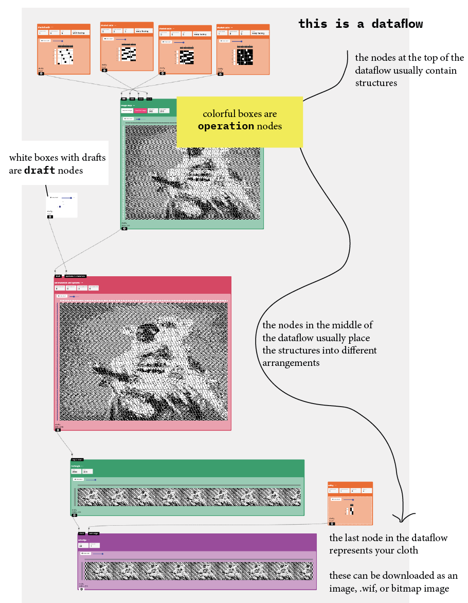

# Operation

Operations are little computational machines that take drafts as inputs, do something to them, and then spit them out as new and different, drafts. An operation consists of several parts:  [inlet(s)](inlet), [parameters](parameter), and a resulting [draft](draft) with an [outlet](outlet). Chaining operations together creates a [dataflow](./dataflow.md) 

In the image above, we see several [`shaded satin`](../operations/shaded_satin.md) operations generating drafts which are connected to an [`image map`](../operations/imagemap.md) operation. the `shaded satin` operations generates shaded satin structures. The specific kind of shaded satin structure it generates is determined by the [parameters](parameter) associated with the `shaded satin`  operation.  You can connect the [outlet](outlet) of the `shaded satin` operation to the inlet of the `image map` operation to chain them together. This will allow you to take the satin generated from the `shaded satin` operation and rotate and apply it to all the pixels of a given color identified by the [`inlet`](./inlet.md). Chaining operations together makes the design flexible so that if you change the parameters of the satin, it will automatically update the image map as well. 

This style of making drafts foregrounds the similarities between the actions weavers perform to design different woven structures and patterns, and the way that programmers make computer programs by making small functions and sequencing together. Yet, in AdaCAD, you get cloth instead of code. 

## Understanding the Parts of an Operation

### Inlets
Inlets allow you to add drafts to an operation, so they can be modified according to the operations [parameters](./parameter.md) and code. You connect a draft to an inlet by clicking the [outlet](./outlet.md) of one node and connecting it to the [inlet](./inlet.md) of an operation. Some operations have 

### Parameters
Under the name of the operation, in this case `set materials and systems` there is a list of [parameters](parameter) that are provided to the operation to inform the draft it will create. 

### Output Draft
Under the parameters, you can see the [draft](draft) that is generated by this operation. 

### Outlet
If you want to use this [draft](draft) as the input of another operation you can connect its [outlet](outlet), shown here, to the [inlet](inlet) of a different operation to make a connection. You can connect a single outlet to multiple inlets. To make a connection, you click on the outlet first, then click on the inlet you want it connected to. 

