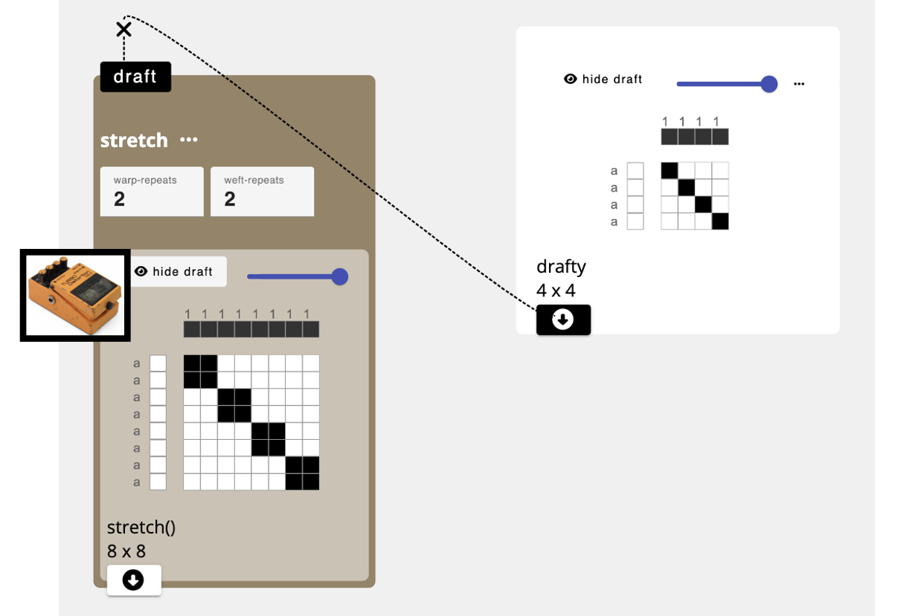

# Parametric Design
AdaCAD takes a ['parametric design'](https://en.wikipedia.org/wiki/Parametric_design) approach to creating woven structures and drafts. 

Parametric design is an approach that asks the designer to explicitly describe a design in terms of a set of rules and relationships that the design should obey. Our approach takes specific inspiration from other parametric design tools such as [MaxMSP](https://cycling74.com/) (parametric design for sound) and [Grasshopper for Rhino](https://www.rhino3d.com/learn/?query=kind:%20grasshopper&modal=null) (parametric design for objects/forms). While parametric design takes a minute to understand and adopt, it can reduce the effort required to make changes, edits, or just playfully explore a design space within a range of user-specified options. 

To specify these relation and generate drafts in AdaCAD, a designer creates a [dataflow](dataflow) made up of both [drafts](../glossary/draft.md) and [operations](../operations/). An operation takes a draft as input, manipulates it according to it's internal rules and user defined parameters, and returns a modified draft. Multiple drafts and operations can be chained together to create drafts of increasing complexity.

## An Analogy
You can think of operations like guitar pedals. A guitar pedal modifies the electrical signals that become amplified as sounds. The pedal takes an input signal from a instrument, and uses its internal electronics to modify the sound. The knobs on the pedal allow the musician to further tune the electronics that shape the  sound. 

In AdaCAD, an operation modifies drafts. The operation takes zero to many input drafts, and uses its internal code to modify that draft according to the specific rules. The user can also change the parameters (e.g. knobs) of the operation to further turn the draft that this operation produces. 

Just as a musician can chain guitar or effects pedals together to continually modify the sounds, a designer in AdaCAD can continually chain AdaCAD operations together to further manipulate and arrange drafts.

## Operations List

AdaCAD offers over 50 operations to generate, manipulate, arrange, and compose drafts. These operations are divided into groups based on their typical application.  You can review and learn more about all of the operations we offer on the [All Operations](../operations/) page. 

## A Note to Weavers Who are New to Parametric Design

We believe that weavers are already doing parametric design implicitly when they plan drafts. For example, a floor loom already structures a range of design possibilities emergent from its physical design and constraints. A weaver can tune the 'parameters' of the loom by providing it with different threadings, tieups and treadlings. AdaCAD requires you to make this intuitive and inherent knowledge of drafting explicit. In doing so, it provides a way to play with other configurations that fit your logics and, ultimately, we hope it offers a way to communicate your process in ways that can be modified across different equipment. 