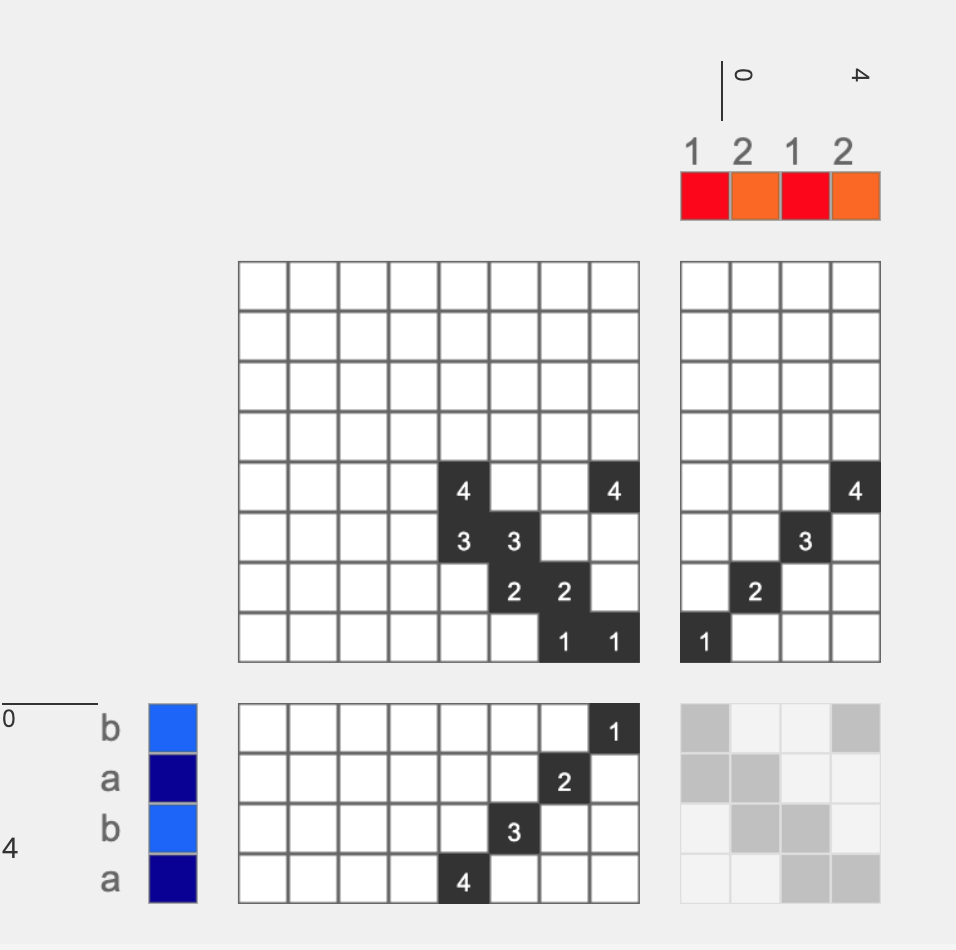

# System

In this context, we use the term `system` to describe groupings of warps (e.g. warp systems) or wefts (e.g. weft systems) that will form specific design relationships. For example, it is common to think of multi-layer weaves as working by interlacing certain wefts upon certain warp systems and then lifting those systems out of the way to create "layered" structures. In another case, you might think of a double sided twill operating of two weft systems, one that will weave on the weft-facing side of the warp and the other on the warp-facing side. 

## Allowable Systems

- weft systems are labeled with single letters. Thus, AdaCAD supports the use of up to 26 weft systems (represented by the letters a-z)
- warp systems are labeled with a number. Thus, AdaCAD supports a nearly unlimited amount of warp systems 

## Assigning Weft and Warp Systems

There are several ways to specify warp and weft systems in AdaCAD. 

### 1. Assigning System Information To a "Seed" Draft
A seed draft is a draft on the workspace that has not been generated by an [Operation](operation). Instead, it was created using the "Add Draft" button.  Put another way, it is a "seed" to the [dataflow](dataflow) and it is visually marked within a plain white box. 

You can modify the system information of these seed drafts directly from the workspace viewer by clicking the letters (for weft systems) and numbers (for warp systems) to change them to the next letter or number in the sequence. 

Alternatively, you can open this seed draft in the draft editor by clicking on the draft and then switching from "Workspace" to "Draft" mode in the top toolbar or clicking the `...` icon on the top right of the seed draft and selecting "open in editor." You can modify the system information on the editor by clicking the letters (for weft systems) and numbers (for warp systems) to change them to the next letter or number in the sequence. 

### 2. Assigning System Information To a Draft in the Dataflow

If you would like to set the system information for a draft that is part of the dataflow, you must use the [`set materials and systems`](../operations/apply_materials.md) as shown below. This operation will apply the systems from one draft to the other, and will repeat the structures as required to account for every warp and weft. 

## Operations that Use Systems
Several operations in AdaCAD make use of warp and weft system assignments to arrange interlacements within a draft. These include: 

- [`assign drafts to system`](../operations/assign_systems.md) - takes a single draft and assigns it to the cells associated with user-specified warp and weft systems. 
- [`layer notation`](../operations/notation.md) - leverages [layer notation](./layer-notation.md) to assign drafts to systems such that different groupings of systems form different layers. 

Other operations will automatically assign different warp or weft systems in their resulting drafts. For example:
-  [`interlace wefts`](../operations/interlace.md) will automatically assign each interlaced weft to a different weft system.  
-  [`interlace warps`](../operations/interlacewarps) will automatically assign each interlaced warp to a different warp system.  
-  [`splice in pics`](../operations/splice_in_wefts.md) will automatically assign each spliced weft to a different weft system.  
-  [`splice in ends`](../operations/splice_in_warps.md) will automatically assign each spliced warp to a different warp system.  
  

