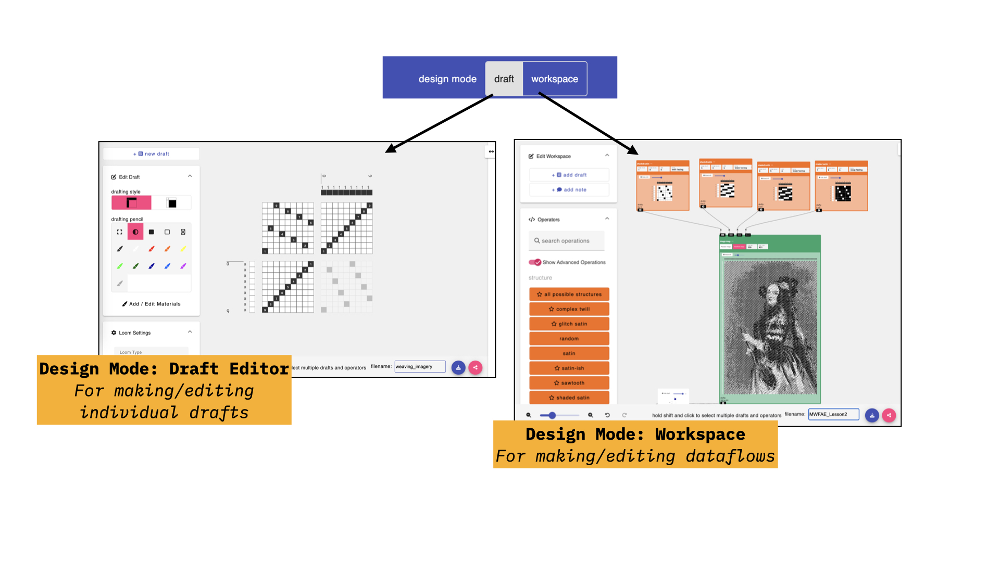
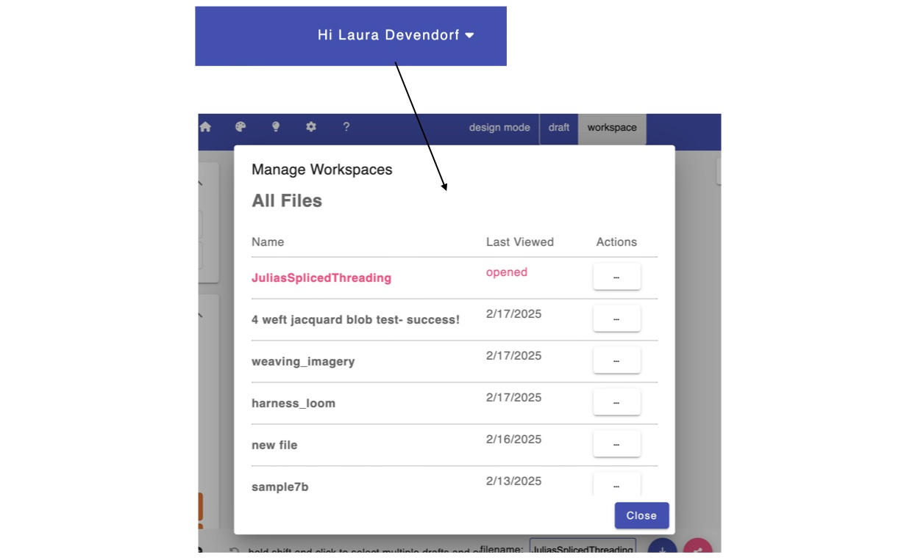

# Topbar

The topbar consists of a series of menus and functions that manage the AdaCAD application overall. 

The topbar is split into several regions, and we'll explain the function of each region below: 

## a. Version Information
This shows the current version of AdaCAD. As a work in progress, we're continually making updates to the software. When this number changes, it means we added or changed something. To explore what we changed, click it to view the [release log](https://github.com/UnstableDesign/AdaCAD/releases)

## b. Application Settings and Support
This collection of buttons gives you access to functions, settings, and resources that are used in all parts of the application

- <FAIcon icon="fa-solid fa-home" size="1x" /> **Load/Save Files**: The home icon opens a menu that provides options for you to load, save, import workspaces. 
- <FAIcon icon="fa-solid fa-palette" size="1x" /> **Add/Edit Materials**: The palette icon opens the material library, allowing you to add/edit the colors available to use with AdaCAD. 
- <FAIcon icon="fa-solid fa-lightbulb" size="1x" /> **Explore Examples**: The lightbulb button opens the examples library, which allows you to explore adn edit pre-made workspaces or load workspaces that other community members have shared. 
- <FAIcon icon="fa-solid fa-gear" size="1x" /> **Configuration Settings**: The gear buttons opens up configuration settings.  These include setting the origin for each draft, which type of loom to assume for each draft, and the default units (ends per inch or ends per 10cm) to use throughout the interface. It also includes the optimize button, which automatically configures settings if your workspace becomes large and starts to slow down the software. 

## c. Design Mode Toggle
This lets you switch the "mode" of drafting in AdaCAD between the [workspace](./workspace.md) and the [draft editor](./draft_editor.md). 

## d. Login or Manage Your Account
Users who create an AdaCAD account are able to save files online. Creating an account requires an email and is managed through Google. We only do it so we can associate the workspaces that you are working on with your email so that you can save, edit, and share them as you wish. If you do have an account, and you click your username, it will open a window that lets you manage all of your saved and shared files.  

