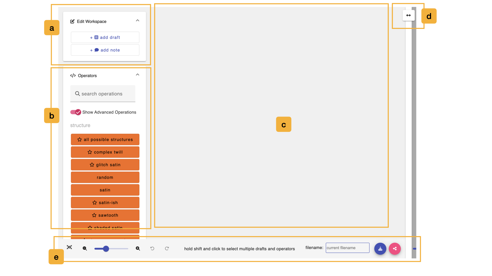
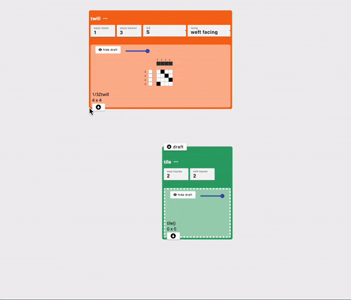

# Workspace

The workspace mode is where you create [dataflows](../glossary/dataflow) to generate drafts. You create dataflows by adding [drafts](../glossary/seed-draft.md) and [operations](../glossary/operation.md) to the workspace and chaining them together into draft generating workflows. 

## a. Add Drafts or Notes to Workspace
The buttons in this window let you add new kinds of nodes to your dataflow workspace. Specifically, you can add drafts or notes.
-  \+ <FAIcon icon="fa-solid fa-chess-board" size="1x" /> add draft,  will open a window to ask for  you to the number of warps and wefts and then will add a blank draft of those dimensions to workspace.
- \+ <FAIcon icon="fa-solid fa-comment" size="1x" /> add note, it will automatically add a note onto the workspace. You can use this note to jot down any additional text information about your workspace. 

## b. Add Operations to Workspace
This side panel allows you to search through and add operations to your workspace. By default, it only shows basic operations. To see all operations, you must enable the "Show Advanced Operations" toggle. 
- <FAIcon icon="fa-solid fa-search" size="1x" /> type in the name of the operation you are looking for into this search box. As you type, the operations below will only include those that match your search.
- the **show advanced operations** toggle is used to show or hide operations that we consider to be advanced. We use it to reduce clutter for new users but once you get a hang of things, flip this toggle to show and explore all the operations AdaCAD has to offer. 
- The rest of the window is devoted to showing one button for each [operation](../glossary/operation.md) that AdaCAD supports. Clicking on any of the operations in this list adds it to your workspace. Operations are grouped and color-coded based on how they tend to be used in the drafting process. You can explore these groupings and all the operations we currently offer by clicking [Reference->Operations(A-Z)](../operations/index.md) in the left sidebar of this page. 

## c. Dataflow Workspace

This area is used to create your [dataflows](../glossary/dataflow.md). You can do this by adding drafts and operations using the interface buttons listed above and then "connecting" them together by connecting the [outlet](../../reference/glossary/outlet.md) of one operation or draft node to the [inlet](../../reference/glossary/inlet.md) of an operation. 

To create a connection, start by clicking the outlet of one node (node a - twill in the example below) to the inlet of another (node b - tile in the example below). This action tells AdaCAD to take the draft created node a and use it as an input to the operation at node b. Node b then runs the operation, and manipulates the draft in accordance with that operations specific code and user-defined parameters. 

### Video
We also offer this video overview of the process of making dataflows: 

<iframe width="560" height="315" src="https://www.youtube.com/embed/kqIYEEV04kM?si=9pgVrze9bFJbVu4K" title="YouTube video player" frameborder="0" allow="accelerometer; autoplay; clipboard-write; encrypted-media; gyroscope; picture-in-picture; web-share" allowfullscreen></iframe>

### Key Commands

- **click** on any draft to open it in the viewer. 
- hold the **shift key + click** any operation or draft to multi-select. 
    - multi-selected nodes can be moved as one or copy/pasted using `command` + `c` and `command` + `v`
- **double click** on any draft to open a menu of possible actions to take on that draft (e.g. open in editor, download, delete, etc. ). 
- **use track pad or mouse-wheel** to scroll the workspace left and right, up and down. 

## d. Resize Window
You can press this button and drag to the left or right to expand/contract the amount of the screen that is devoted to the workspace. 

## e. Adjust View, Save and Share
The footer in this section is devoted to managing the state of the workspace. The left-most set of controls allow you to zoom in and out of the workspace. 

- <FAIcon icon="fa-solid fa-arrows-to-eye" size="1x" /> **Fit to Window**: This button will automatically resize and scroll the view so that your entire dataflow is visible within the workspace window. If you have selected or multi-selected drafts and operations, this will fit the view to your selection. 

- <FAIcon icon="fa-solid fa-search-minus" size="1x" /> **Zoom Out**: This button will zoom out from the top left corner of the view. You can also do this by pressing `command` + `-` key
-  **Zoom Slider**: Reflects the current level of zoom and can be moved freely to zoom in and out
- <FAIcon icon="fa-solid fa-search-plus" size="1x" /> **Zoom In**: This button will zoom in from the top left corner of the view. You can also do this by pressing `command` + `+`

Next, we encounter the buttons that control the state of our design: 
- <FAIcon icon="fa-solid fa-rotate-left" size="1x" /> **Undo**: AdaCAD stores your last 10 edits. If you want to move back to a previous edit, use this "undo" button. You can also do this by pressing `command` + `z`
- <FAIcon icon="fa-solid fa-rotate-right" size="1x" /> **Redo**: If you want to move forward to an edit that you had previously un-done, use this "redo" button.

In the center of the footer, we'll occasionally add tips and tricks to try. 

To the right, we have options for naming and downloading or sharing the workspace. 
- the **filename** text box allows you to give this workspace a name. This is the name that will be used to label the workspace if you download it (e.g. your_name.ada) or if you choose to save it on your AdaCAD account. 
- <FAIcon icon="fa-solid fa-download" size="1x" /> **Download**: click this to download the workspace as a .ada file. Additionally, if you have a draft selected on the workspace, you can choose to download that draft as a .WIF, bitmap or image file. 
- <FAIcon icon="fa-solid fa-share-nodes" size="1x" /> **Share**: Click this button to create a link to your workspace. Anyone who visits that link will get to open and edit your workspace. 

<!-- 

A typical dataflow might connect operations of different types in a particular order. For instance, the dataflow usually begins with the creation of a structure that is transformed and expanded or repeated over the cloth. Color sequences can be added at the end to support visualizing the visual affects of different warp and weft yarn color combinations. 

<a class='button_open primary' href="https://adacad.org/?ex=first_workspace" target="_blank">Open the "Getting Started" Workpace</a> to play around with this sequence for yourself
 -->

<!--  -->

<!-- Multiple operations can be chained together into a dataflow, as shown in the image above. A typical dataflow connects operations of different types in a particular order. For instance, the dataflow usually begins with the creation of a structures that are transformed,  expanded or repeated over the cloth. Color sequences can be added at the end to support visualizing the visual affects of different warp and weft yarn color combinations. At the end of the workflow, the draft is usually adapted to meet the specifications of your loom. For a TC2, you can use the [rectangle](../../reference/operations/rectangle.md) operation to repeat your design over a region the size of your loom (for us, it's 2640 ends). For a dobby or floor loom, you can pipe the final draft into the ['generate floor loom threading and treadling from drawdown'](../../reference/operations/floor_loom.md) to generate three drafts representing the threading, treadling, and tieup required to reproduce the design. 

After you have created a dataflow, start to play. Anything you change will ripple down the entire flow, changing your result! -->

<!-- 
### Benefits of Designing with Dataflows
Our idea to use this dataflow approach to drafting emerged from two shared experiences: 

(1) a frustration with clicking point paper cells, particularly with making complex structures
(2) the realization that we, and other weavers, were implicitly performing algorithmic design and programming when drafting cloth. Weave drafts follow algorithms, or specific rules for how they place interlacements in relation to one another. These algorithms reveal different patterns in the draft, and subsequently, different structural and mechanical features in the cloth. 

For example of a simple operation performed by weavers is what we call, *invert* (shown above in example a). *Invert*  changes all the black cells in a draft to white and vice versa. Weavers often perform this operation when working with unbalanced structures and contrasting colors in the warp and weft. In these cases "inverting" the draft has the effect of making the warp or weft color more dominant in a region of the cloth. 

Another example is a *stretch* operation (shown above in example b), which repeats each interlacement across a user-specified number neighboring of warps and wefts. A weaver might do this if they find that their cloth is not weaving square (e.g. it's building more in the length then width). They can correct this imbalance by adding warp repeats, effectively stretching the structure across the width so it can square up with the height. AdaCAD contains numerous operations to do common and unusual things to drafts. 

As a computer scientist by training, Laura implemented the dataflow approach because to her, writing the code was faster than clicking the pixels. Additionally, it opened up new ways of exploring the design space for weaving by creating generative workflows that could create a variety of different drafts that all obeyed the same set of rules and relationships that would be required to make cloth of a particular type. 

In presenting this approach to other weavers, and building out new features in the software, we learned that the dataflow approach also has some benefits in that it documents the rationale behind a given design....not just the outcome. The rationale, visible in the dataflow, can be used to share a design with someone else or to simply enable someone to identify where a specific error occurred within their design without starting the draft again from scratch. We describe these results in detail in our [2023 publication, AdaCAD: Parametric Design as a New Form of Notation for Complex Weaving](../../about/research.md#adacad-parametric-design-as-a-new-form-of-notation-for-complex-weaving-chi-2023). 
 -->
