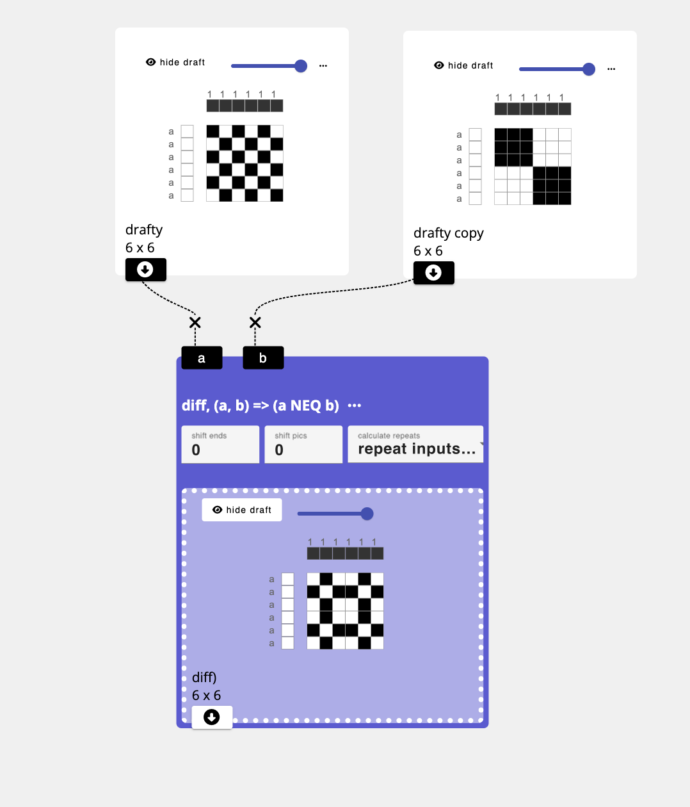

# diff, (a, b) => (a NEQ b)
Applies binary math to two drafts. To do so, it looks at each interlacement in input drafts a and b and it returns a black cell in any location where the two draft cells were different

## Parameters
- `shift ends`: shifts the position of the ends in draft a
- `shift pics`: shifts the position of the pics in draft a
- `calculate repeats`: this defines what happens if/when you connect drafts with different pic numbers. If `repeat inputs to match size` is selected, AdaCAD will expand the number of pics and ends in the output draft such that all structures repeat at the even intervals across along width and length of the cloth. If the `do not repeat inputs to match size` is selected, unset rows will be added to drafts with fewer pics. 

## Application
No established application, but a fun way to see how to apply binary math to the production of drafts. Diffs are widely used in computation to compare how two things are similar or different

## Developer
adacad id: `diff`
